I/O Stream adalah mekanisme dasar untuk melakukan operasi input dan output di program anda

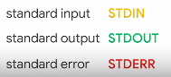

The standard output stream or STDOUT is a pathway between a program and a target of output, like a display

STDOUT generally takes the form of text displayed in a terminal
STDERR Standard error displays output like standard out, but is used specifically as a channel to show error messages and diagnostics from the program. It's usually printed to the screen

## Shell
adalah command line untuk berinteraksi dengan OS, di linux disebut dengan bash

we can check variables using the env or nth command

	$env

variabel defaulf
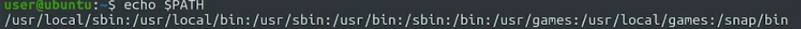

python dapat berjalan di command prompt
membuat variable
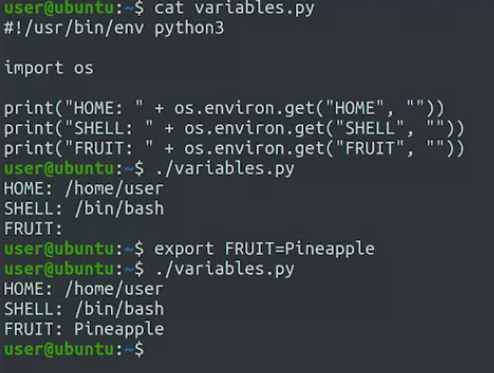

#### command line arguments 
parameter yang diteruskan ke program ketika program pertama berjalan. 

	import sys
	print(sys.argv)

#### exit status
exit status, adalah nilai yang dikembalikan oleh program ke shell
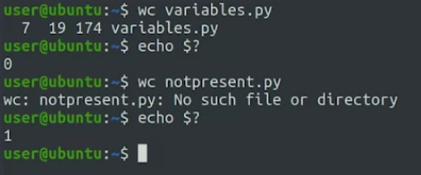
jika program berjalan akan mengembalikan angka 0, yang berarti berhasil, dan sebaliknya. 

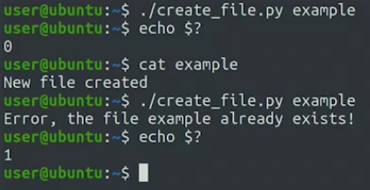

dalam kasus tersebut, meskipun kode error digenerate oleh python itu adalah hasil tidak error, tetapi python memodifikasinya
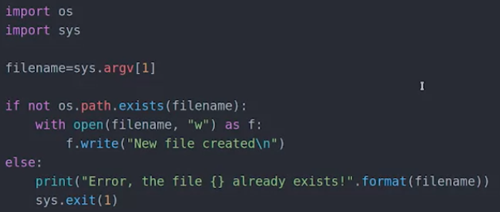

## Subproses
subproses, meaning sub of a parent proses. digunakan untuk mengeksekusi perintah shell atau subproses pada sistem operasi yang sama dengan Python. Fungsi ini mengembalikan objek CompletedProcess yang berisi informasi tentang hasil dari proses yang dijalankan.

subproses.run lebih direkomendasikan daripada os.system() dan subprocess.call()

dibawah ini hanya bisa dilakukan di python 3.7 or above untuk menjalankan capture_output
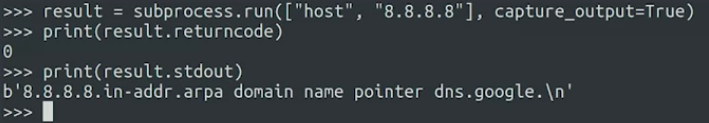

0 adalah stdout yang menandakan berhasil di execute dapat dihasilkan lewat python ketika mengaktifkan capture_output=True

UTF-8 adalah encode dari byte2 ada lain misalnya Big 5

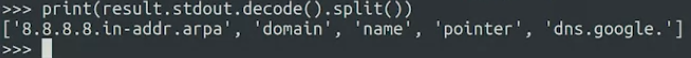
di encode secara default pengaturanya adalah engan UTF-8, kecuali anda mengubahnya sendiri

** ' **f we're automating a one-off, well-defined task, we're developing a solution quickly is the biggest requirement, then using system commands and subprocesses can help a lot** ' **

contoh nyata penggunaan subproses
1. menjalankan perintah shell dari dalam program Python. Misalnya, jika kita ingin membuat salinan backup dari file atau direktori
2. Menjalankan skrip Python dari dalam program Python: Kita juga dapat menggunakan subprocess.run() untuk menjalankan skrip Python lain dari dalam program Python
3. menangkap output dari perintah shell atau subproses yang dijalankan. Misalnya, jika kita ingin menjalankan perintah ls pada sistem Unix dan menangkap outputnya
4. menjalankan subproses dengan opsi tambahan seperti mengatur direktori kerja, mengatur variabel lingkungan, dan memasukkan masukan (input) ke dalam subproses. contoh script

import subprocess

	# Menjalankan skrip Python lain dengan opsi tambahan
	result = subprocess.run(['python', 'other_script.py', '--dir', '/path/to/dir'], cwd='/path/to/script')

tiap spasi dalam terminal, direpresentasikan commas (,) dalam subproses ini

# log files

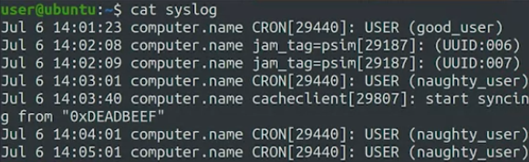

ini adalah hasil log files, kita dapat memanfaatkan regex untuk ekstraksi / memfilter informasi yang dapat diambil dari log files.

misalnya adalah seperti ini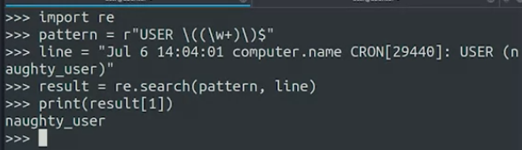

kita masukkan ke script
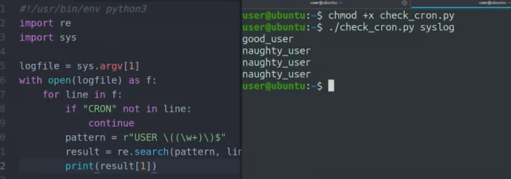
 
 
 ini 

 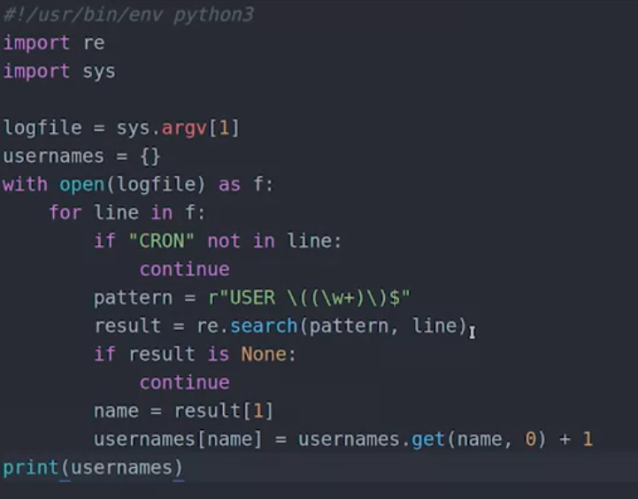
 
 hasilnya
 
 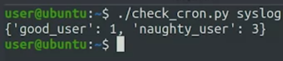
 
 dia itu ekstraksi dari sys.log dengan file python ygy dan memanfaatkan pattern regex. 