ini adalah mengkopi spider.txt dari direktori sebelummnya (..) ke direktori sekaran(.)

ls: menampilkan daftar file dan direktori dalam format standar.
ls -a: menampilkan semua file, termasuk yang diawali dengan titik (.).
ls -l: menampilkan daftar file dan direktori dalam format panjang (long format), termasuk informasi tentang hak akses, pemilik file, ukuran file, waktu modifikasi, dan lain-lain.
ls -la: menampilkan semua file, termasuk yang diawali dengan titik, dalam format panjang.
ls -h: menampilkan ukuran file dalam format yang mudah dibaca manusia (human-readable), seperti kilobyte (KB) atau megabyte (MB).
ls -R: menampilkan daftar file dan direktori secara rekursif, yaitu menampilkan isi dari setiap direktori secara terperinci.
ls -t: mengurutkan daftar file dan direktori berdasarkan waktu modifikasi, dengan yang paling baru di atas.

ini adalah contoh redirecting, dimana dia akan menuliskan STDOUT ke sebuah file
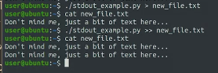

yang mana file pythonya tadi adalah 

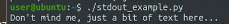

dan dibawah ini tanda < untuk STDIN, mengarahkan suatu file ke python

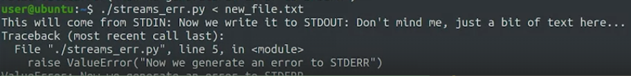

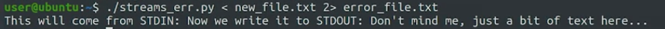

atau secara mudahnya adalah sebagai berikut
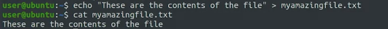

# Pipeline

pipe dilambangkan dengan ' | ' 

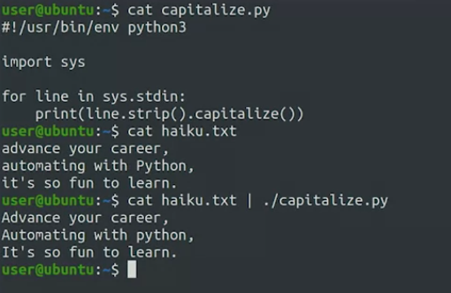

Using signals, we can tell a program that we want it to pause or terminate. We can also cause it to reload its configuration, or to close all open files.

CTRL + C membuat terminate
CTRL + Z 
This time the process didn't finish properly. We get a message saying that it's stopped. What's going on? The signal that we sent is called SIGSTOP. This signal causes the program to stop running without actually terminating. But don't worry, we can make it run again 

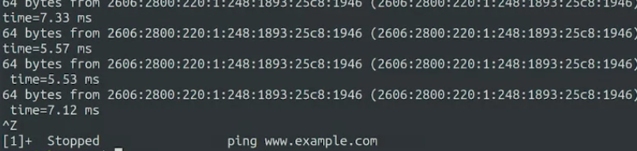

kita dapat melanjutkanya lagi denan mengetikkan fg
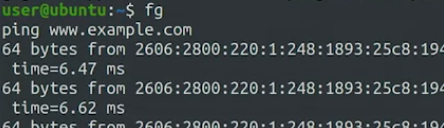

tetapi jika menggunakan CTRL + C itu membuat program finish dengan bersih

diatas dinamakan dengan SIGSTOP

To find out the PID that we want to send the signal to, we'll use the ps command which list the currently running processes. Depending on what options that we pass, it'll show different subsets of processes with different amounts of detail.

We'll run ping on one terminal, and then find its PID and kill it from a second terminal.

#### yolo ASSD

dibawah ini terbuka dua terminal, terminal satu menjalankan ping, terminal satunya lagi mencari PID untuk membunuh terminal satunya lagi yang sedang berjalan
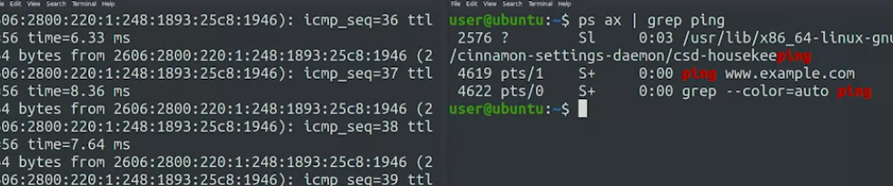

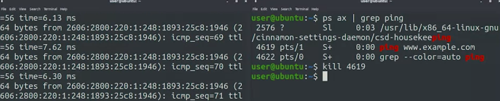
kill untuk membutuh dengan menunjukkan PID nya

## Ringkasan kode
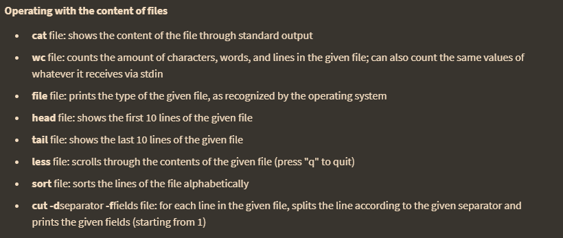

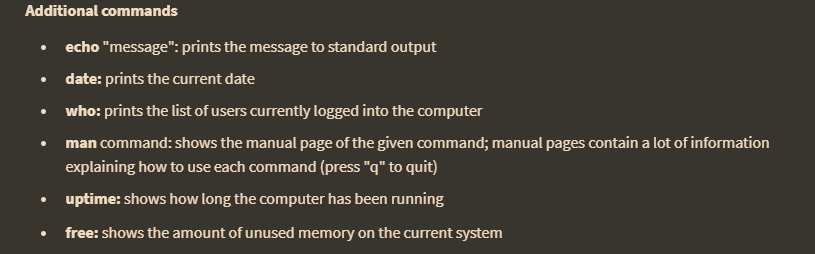

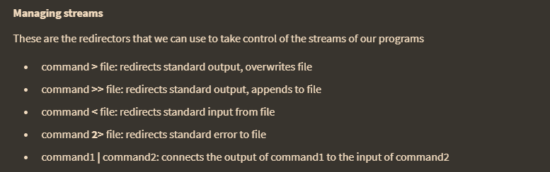

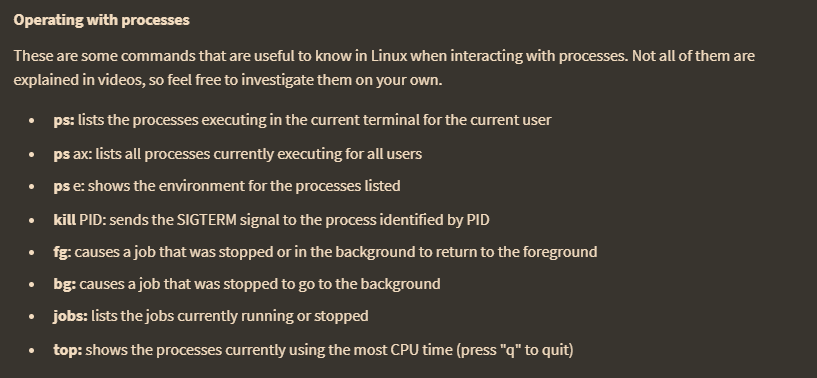