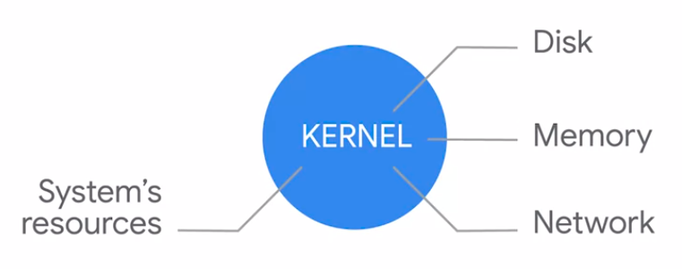
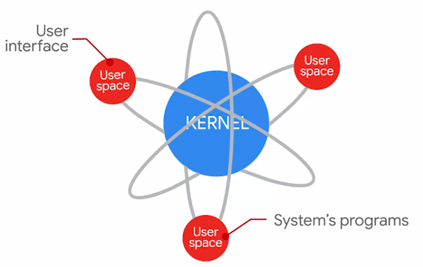
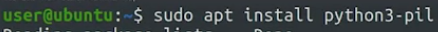
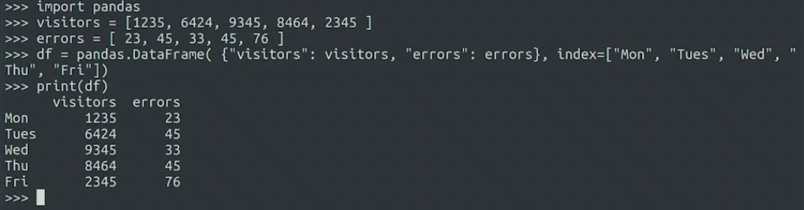

course prerequires
1. The basic Python syntax (if, for, while, defining functions, classes, and methods)
2. How to use the most common data structures (strings, lists, tuples, and dictionaries)
3. How to import and use additional Python modules

kernel bertanggung jawab untuk mengelola sumber daya komputer dan memfasilitasi interaksi antara perangkat keras dan perangkat lunak. beberapa jenis kernel yang berbeda, termasuk kernel monolitik, kernel berbasis mikro, dan kernel hybrid. 

Some common Linux distributions are; Ubuntu, Debian, and Red Hat. android berjalan diatas kernel linux

Use a package management system called Chocolatey to manage the installation, especially on windows [10 Installing Python 3 on Windows 10 with Chocolatey](https://www.digitalocean.com/community/tutorials/how-to-install-python-3-and-set-up-a-local-programming-environment-on-windows-10)
 
Linux package manager, The name of the tool to manage a local packages will depend on the distribution that you're using. It's called App on Debian Ubuntu and Linux Mint, yum on Red Hat or CentOS, and DNF on Fedora

install modul python bisa lewat apt (linux-ubuntu package manager) atau pip (python package manager)

dapat printing dataframe di terminal
