### Software testing
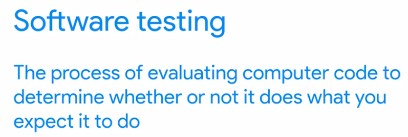

unit test
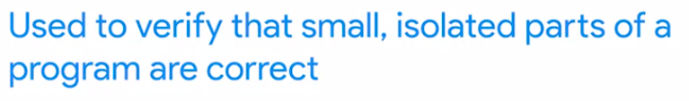

contoh unittest, ini menggunakan modul

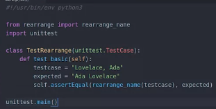	

result
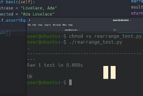

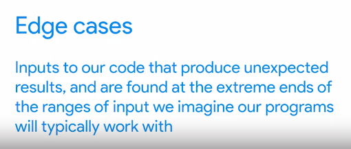

jika berhasil unittestnya akan mengembalikan seperti ini
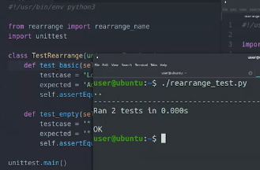

_====

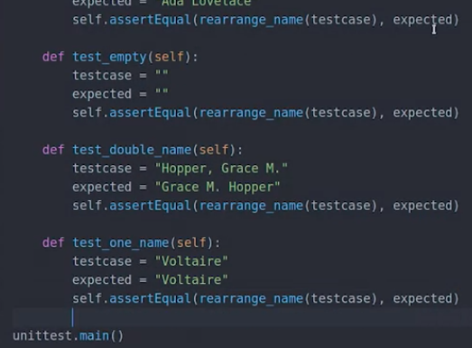
output
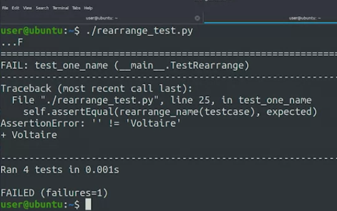

jadi ini expetd dan inputnya masih ditulis didalam script bukan input dari cmd. berikut adalah keuntungan membuat script test

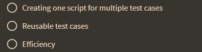

dibawah adalah dokumentasinya untuk bisa digunakan saat testing dengan modul terkait
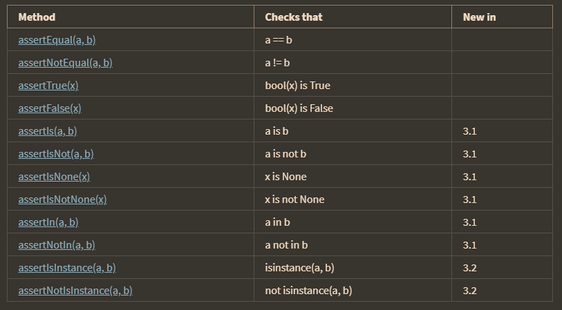

# Other Test Concept
### whitebox testing
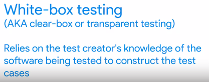

### blackbox testing
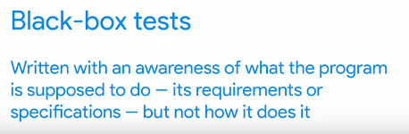

White-box tests are helpful because a test writer can use their knowledge of the source code to create tests that cover most of the ways that the program behaves. Black-box tests are useful because they don't rely on the knowledge of how the system works. This means their test cases are less likely to be biased by the code. it means, blackbox is opaque code

#### smoke test
 Smoke test sometimes called build verification test, get their name from a concept that comes from testing hardware equipment. dimana code berkebul (mengeluarkan asap) seperti halnya komputer yang mengeluarkan aspa jika rusak. 
 
 ada pengujian lain, yang memverifikasi ketika banyak consumer, kinerjanya dipastikan tidak menurun
 
 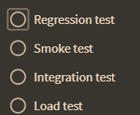
 
 ### Test-driven test
 First you write your script then you write tests that verify that the script does what you want it to do. But this isn't always the best approach. A process called test-driven development or TDD calls for creating the test before writing the code. berikut adalah kerugian test-driven test
 
 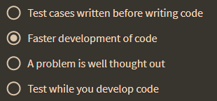
 
 ## summary
 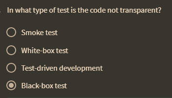
 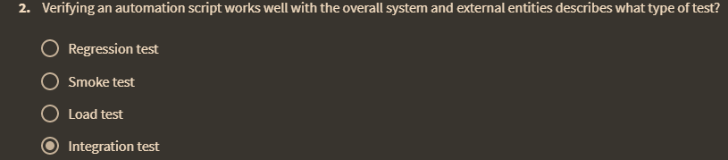
 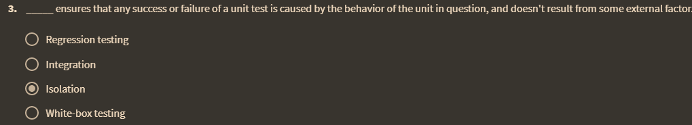
 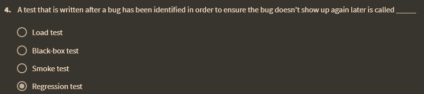
 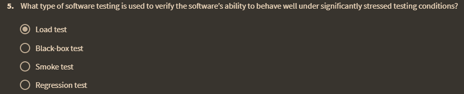
 
 
