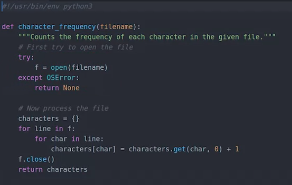

itu ada try-except nya lur
If there's an error, it then goes into the accept part of the block that matches the error and does whatever cleanup is necessary. Here we have only one except block, for the OSError error type, but there could be more blocks if the functions called could raise other types of errors. So when writing a try-except block, the important thing to remember is that the code in the except block is only executed if one of the instructions in the try block raise an error of the matching type.

bahasa indonesianya, itu jika masuk kedalam blok except, adalah jika kesalahanya adalah sama seperti yang dikondisikan (OSError) dan dari blok itu bisa melakukan pembersihan. itu dasanya kemarin itu sepertinya echo $?

********

dititik beratkan pada fungsi ValueError()
jika dijalankan seperti ini
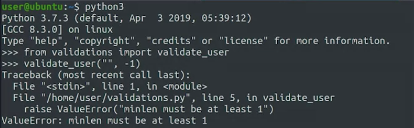

jika di inputkan dengan value yang benar

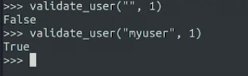

dan dibawah ini jika kita tidak mngatur ValueError

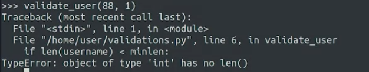

kemudian dibawah ini menunjukkan bahwa [] berpengaruh 
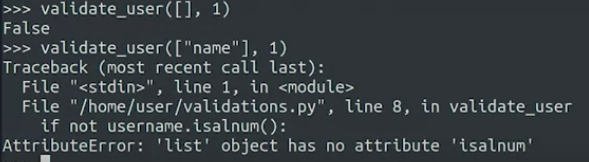

### assert
let's look at an alternative to the raise keyword that we can use for situations where we want to check that our code behaves the way it should particularly when we want to avoid situations that should never happen. This is the assert keyword. This keyword tries to verify that a conditional expression is true, and if it's false it raises an assertion error with the indicated message. seperti ini penggunaanya

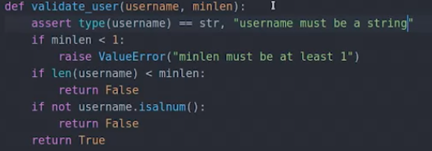

the result

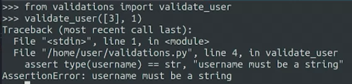

kesimpulan:

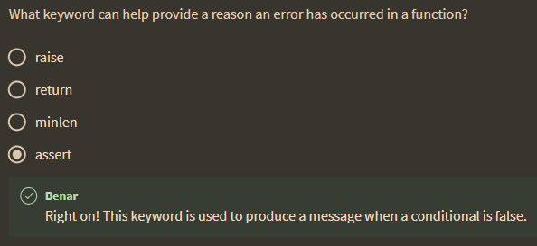

**************

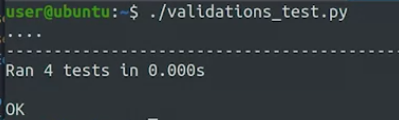

so 

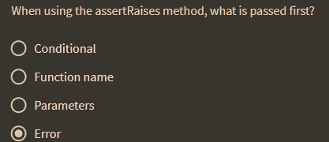

## practical

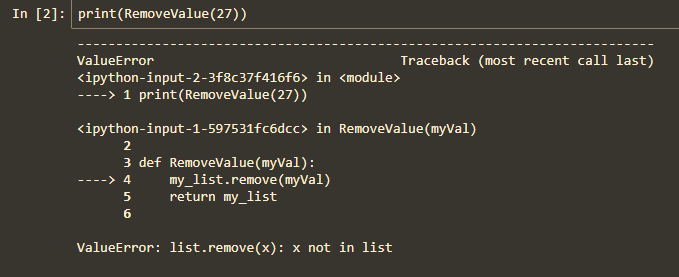

itu adalah salah satu contoh yang mengatakan, error tidak menunjukkan yang seharusnya. buka di 0_IntroPython untuk praktik notebook yang sama (saya sudah mendownload)

dan seperti ini seharusnya pembenaranya

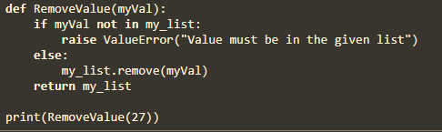

aplikasinya untuk index out of range
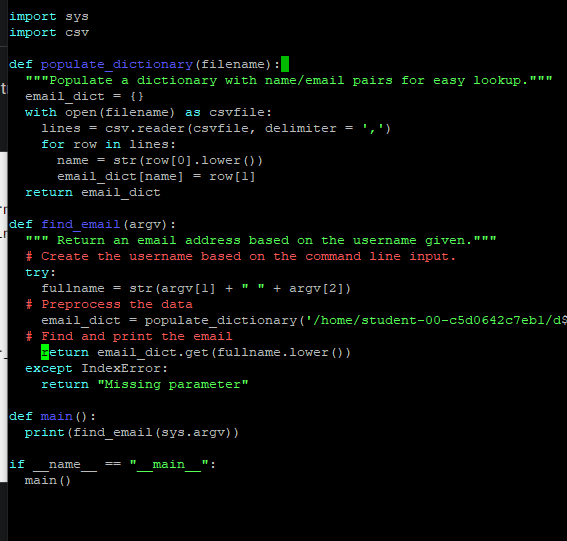

anda bisa mengolah sedemikian rupa sehingga output dari sebuah error adalah pesan yang bisa dibaca orang awam

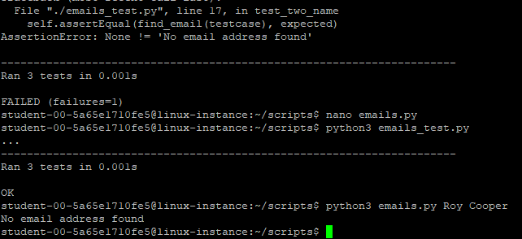

