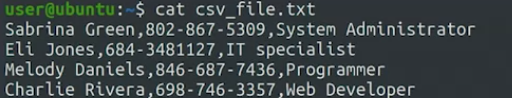
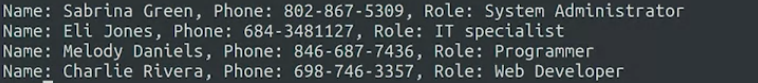
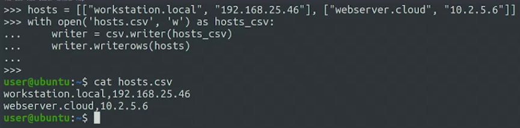
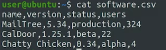
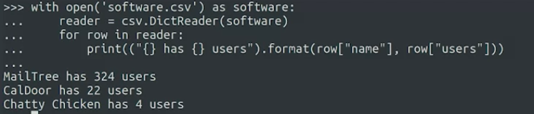
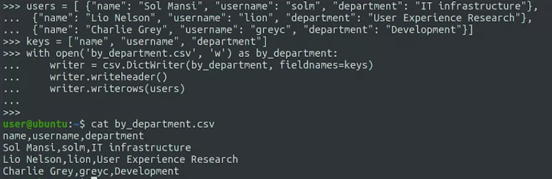

HTML is a markup format which defines the content of a webpage. JSON is a data interchange format commonly used to pass data between computers on networks, especially the internet. CSV or comma separated values is a very common data format used to store data as segment of text separated by commas.

#### parsing

analsis konten struktur data dengan benar

CSV is a pretty simple format. contohnya

### open CSV file

import csv
file = open('CSVFile.csv')
fileCSVFile = csv.readaer(file)
for row in fileCSVFile:
  name, phone, role = row; print('name:{}, phone:{}, role:{}'.format(name, phone,row)
  
  
 you can use row[0]
 
 menulis
 
 
 #### search by key
 the csv file:
 
 
 how read it with dictreader
 
 
 menulis dengan dictreader
 
 
DictReader() allows us to convert the data in a CSV file into a standard dictionary. DictWriter() \ allows us to write data from a dictionary into a CSV file. What’s one parameter we must pass in order for DictWriter() to write our dictionary to CSV format?

for more : [*](https://docs.python.org/3/library/csv.html) [*](https://realpython.com/python-csv/)