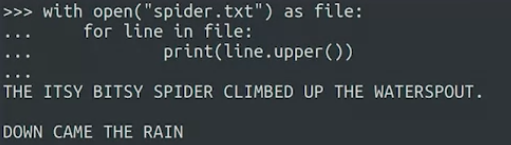
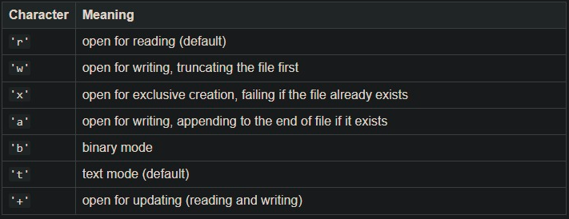
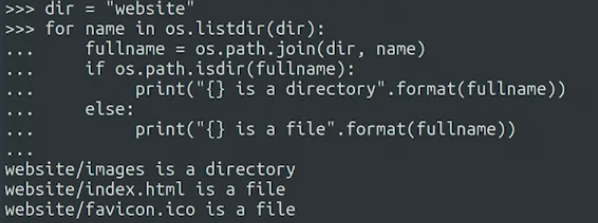

absolute path untuk windows
C:\Users\Jordan

sedangkan untuk linux
/home/jordan

jalur absolut memudah kan untuk mengarahkan ke sumber daya. 

### File descriptor
sebuah token yang digenerate oleh OS yang memungkinkan program dapat berbuat banyak kepadanya. dengan object file ini kita bisa membaca dan mencetaknya dilayar

### read file
membuka dapat menggunakan dua metode yaitu with dan tanpa with, jika menggunakan with maka itu akan membuat blok kode sehingga setelah selesai file akan tertutup otomatis, sedangkan jika tanpa with anda harus menutupnya secara manual tetapi itu mungkin akan lebih fleksibel

The readline() method reads a single line from the current position, the read() method reads from the current position until the end of the file.

### iterating through files

gunakan print(line.strip().upper()) untuk menghapus enterspace berlebih

jika berhadapan dengna data besar, baiknya mengelola line by line, agar memori kuat. saat membuka dokumen argumen default adalah 'r' yaitu read

### using OS
import os
os.remove('novel.txt')
os.rename('guest.txt', 'fixedguest'.txt)
os.path.exist('fixedguest.txt') #output True, knowing file exist or not
os.path.getsize('spider.txt') #output size of bytes format
os.path.getmtime('spider.txt') #output timestamp **It represents the number of seconds since January 1st, 1970**
anda bisa mengubah formatnya menggunakan modul datetime
import datatime
vdatetime = os.path.getmtime('spider.txt') 
datetime.datetime.fromtimestamp(vdatetime)

os.path.abspath('spider.txt') #this usefull

### os.getcwd
os.getcwd() #ouput knowing work directory now
os.mkdir('newfolder') #make folder named newfolder
os.chdir('newfolder') #get newfolder as current working directory
os.getcwd() # check where current working directory is
os.rmdir('aFolder') #remove directory
os.listdir('website') #ouput ['images.jpg', 'index.html', 'favicon.ico']
 os.chdir("..") #kembali ke dir atasnya

itu membuat full path untuk suatu file
dalam MacOS dan linux menggunakan slash (/)
dalam windows menggunakan backslash (\)

for more[*](https://docs.python.org/3/library/os.path.html)[*](https://docs.python.org/3/library/os.html)

