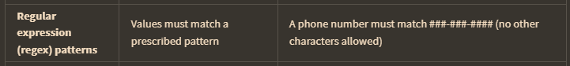
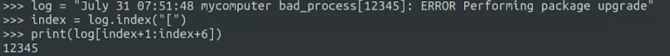
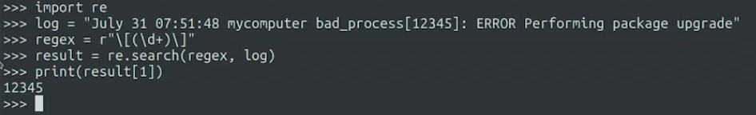

regular expression dikenal juga dengan regex atau regexp pada dasarnya adalah query yang direpresentasikan oleh pola string. regular expressions allow us to search a text for strings matching a specific pattern. regex sangat berguna siapapun melakukan pemrosesan text. 

For example, if I have a file that lists NFS mounts and options and I want to pull only the server name, I can write a regular expression that strips each line of the excess data and returns only a list of the information I need.

Regular expressions are a pretty big topic in IT. We can also use command line tools that know how to apply regexs, like grep, sed, or awk

contoh diatas, adalah mudah karena kita sudah tahu jumlah digid yang ada di bracket, tetapi dalam beberapa kasus kedepan mungkin kita tidak tahu berapa jumlah digid dalam bracket, sehingg membutuhkan regex yang berbeda, bisa menggunakan seperti ini

