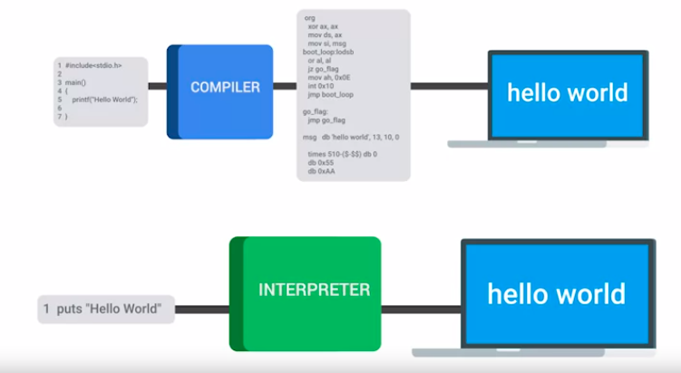
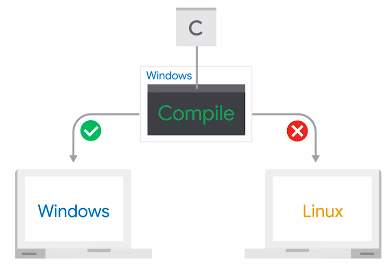
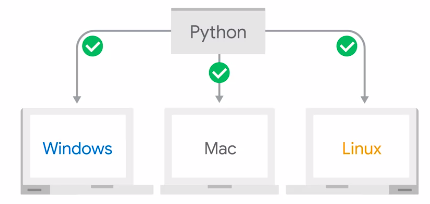
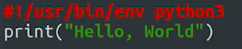
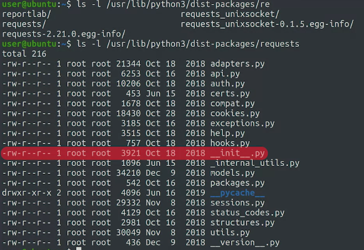

compiled languages faster from intepreted languages, but compiled languages use a bit time to compiling these program before running

it gets compiled into intermediate code

### exit python from terminal
when using windows and MacOS : ctrl + z (then enter)
when using linux : exit()

## directly run python (shebang)

shebang used to specify beforehand what command to use when running the script.

#!/usr/bin/env python3
Now, this is important, because it sets the Python version to Python 3.

dengan menambahkan kode baris seperti diatas (merah), sehingga dapat dijalankan langsung tanpa memanggil python terlebih dahulu seperti 

	python3 helloworld.py

tetapi dapat langsung dijalankan seperti ini

	./helloworld.py
	
tetapi sebelum itu, anda harus memberikan perizinan untuk file dapat dijalnakan, dengan memberi chmod lewat terminal

request module dari terminal

# IDE
(Integrated Development Environment)
vim adalah kode linux, salah satu fiturnya adalah pewarnaan kode

### scability
Scalability means that when more work is added to a system, the system can do whatever it needs to complete the work. misalnya 
An IT engineer writes a script to compile a report on each machine's uptime and downtime for the day and email it to relevant parties every evening. 

pertimbangan otomasi perlu dilakukan adalahl sebagai berikut

say you generate a daily report on your systems usage and it takes you five minutes a day to do it. If automating this test takes you one hour, then in 12 days, you've already saved the 60 minutes it took you to create the automation

other example:

An employee at a technical support company is required to collate reports into a single file and send that file via email three times a day, five days a week for one month, on top of his other duties. It takes him about 15 minutes each time. He has discovered a way to automate the process, but it will take him at least 10 hours to code the automation script. Which of the following equations will help them decide whether it's worth automating the process?

if [10 hours to automate < (15 minutes * 60 times per month)] then automate

52 minggu -> 520 menit
1 minggu -> 10 menit
coding -> 40 jam -> 2400 menit

saving -> 520 - 2400 menit
saving -> -1950 menit

### forensik otomasi
Nilai forensik mengacu pada kemampuan proses otomatis untuk meninggalkan log terperinci dan ekstensif yang dapat digunakan untuk menyelidiki kesalahan