Grep stands for "Global Regular Expression Print", it is a command-line regex tool.

grep akan memunculkan semua tulisan yang mendandung angka yang dimaksud
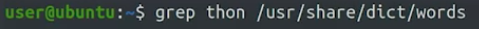

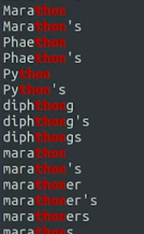

dot akan merepresentasikan karakter apapun seperti dibawah ini
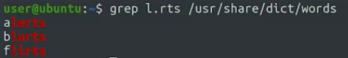

 circumflex [^] : matching pada awal kalimat
 dollar sign [$] : matching pada akhir kalimat
 
 The characters such as dollar sign ($), circumflex (^), and dot (.) are collectively known as "Special characters" or "Metacharacters" in regex
 
 ## mathcing
 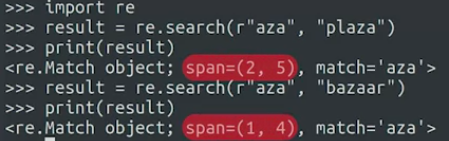
 
 mencocokkan satu karakter saja
 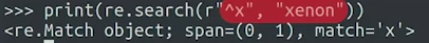
 
 menggabungkan regex dengan mathcing
 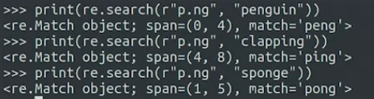
 
 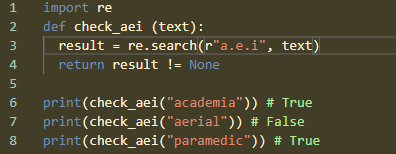
 r"a.e.i" ini akan mengecek apakah huruf vokal berada di antara huruf tidak vokal
 
 berikan .IGNORECASE untuk mengabaikan besar kecil huruf
 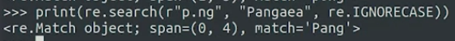
 
 dot '.' can match any character, it is called wildcard because it can match more than one character
 
 ##### character class
 character class ditulis dalam bracket and let us list the character we want match inside of those bracket seperti ini
 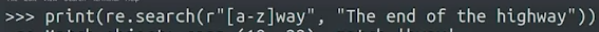
 [x]way dimana x bisa berupa a-z
 tetapi itu tidak bisa mendektesi spasi
 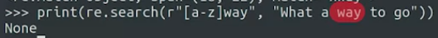
 
 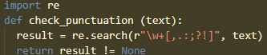
 diatas adalah untuk mengecek apakah suatu kalimat mengandung , . : ; ? atau !
 
 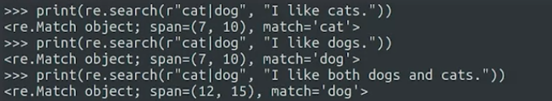
 
 untuk mencari cat atau dog
 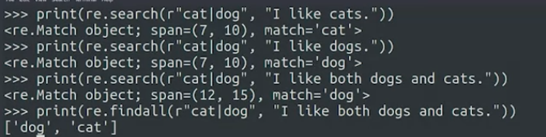
 
 mencari akhiran yaitu dengan *x dimana x adalah karakter yang diinginkan, ini termasuk spasi juga akan diambil atau karakter apapun
 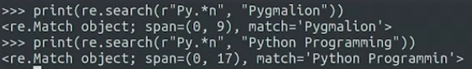
 
 tetapi jika anda ingin spesifik saja tambahkan bracket dan diisi apa yang diinginkan
 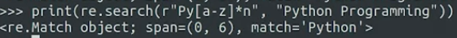
 
 (saya menyimak di coursera tidak sampai selesai)
 
 for more: www.regex101.com
 
 # Study case
 mengganti domain
 def contains_domain(address, domain):
  domain_pattern = r'[\w\.-]+@'+domain+'$'
  if re.match(domain_pattern, address):
    return True
  return False
  
  for tutorial : [*](https://googlecoursera.qwiklabs.com/focuses/26908998?parent=lti_session)