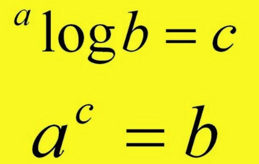

a dinamkan dengan basis.  Dalam matematika, logaritma basis 10 dari suatu angka x, dilambangkan sebagai log₁₀(x) atau hanya log(x) jika tidak ada basis yang ditentukan secara khusus.

log₁₀(x) apabila di transformasikan dalam bentuk berbeda, penulisanya yaitu 10log(x).