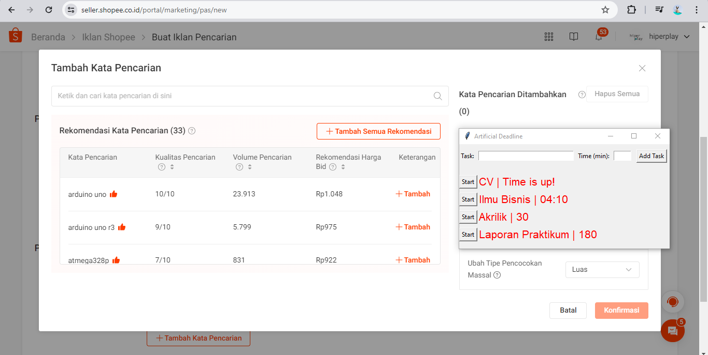

1. Shopee keyword, yaitu dengan melihat tren judul, anda tidak perlu membayar dulu dan bisa melihat tren pencarian.

perhatikan jumlah bid di shopee, apabila bid nya diangka 1000 maka pencarian lebih banyak dari pada volume dipasaran? 

Tool lainya adalah shopee mobduos berikut https://shopee.mobduos.com/ itu indonesia dapat dianalisis dengan software buatan cina ini

Resoruce:[*](https://www.youtube.com/watch?v=9aIbB4cKiHg)