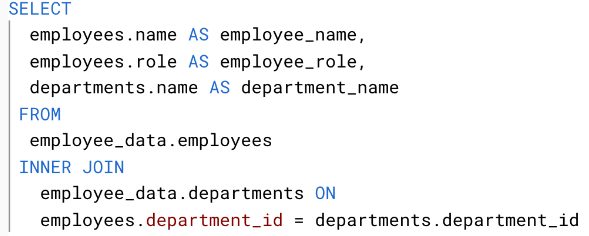
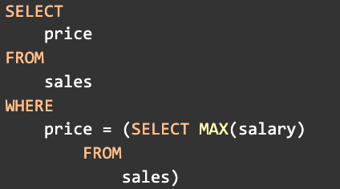
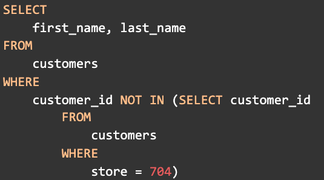
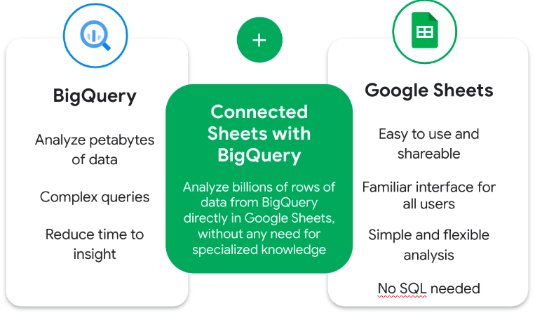

contoh penggunaan dalam SQL

Key difference between COUNT and COUNT DISTINCT in a database query is COUNT returns the number of rows in a specified range. COUNT DISTINCT only returns the distinct values in a specified range. 

In SQL, a subquery is a query nested within another query.

contoh subquery

yaitu sebuah queri yang berada pada queri

The AVERAGE function finds the average of a set of values in spreadsheets. When using SQL, the function is AVG. 

The purpose of the EXTRACT command in a query is to extract a part from a given date. The EXTRACT command can extract any part from a date/time value. 

### Data validation process
The data validation process is a form of data cleaning. During this process, data analysts check the quality of their data to make sure it’s complete, accurate, secure, and consistent.

types of data validation
data type, data range, data constrains, data consistency, data structure, code validation

BIgQuey Connect to Google Spreadsheet

The SQL keyword that is used to define a name for a calculated column is: AS

The purpose of the <> operator in SQL is: To check if two values are not equal.