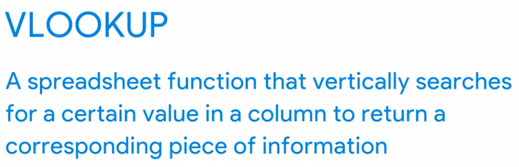
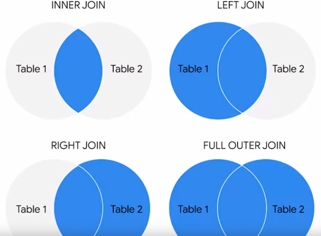

If you enter FALSE as the last input parameter in a VLOOKUP function, VLOOKUP will search for an exact match.

JOIN is a SQL clause that combines rows from two or more tables based on a related column. INNER JOIN, OUTER JOIN, LEFT JOIN, and RIGHT JOIN   variations are available. If JOIN is used, an INNER JOIN is assumed.

