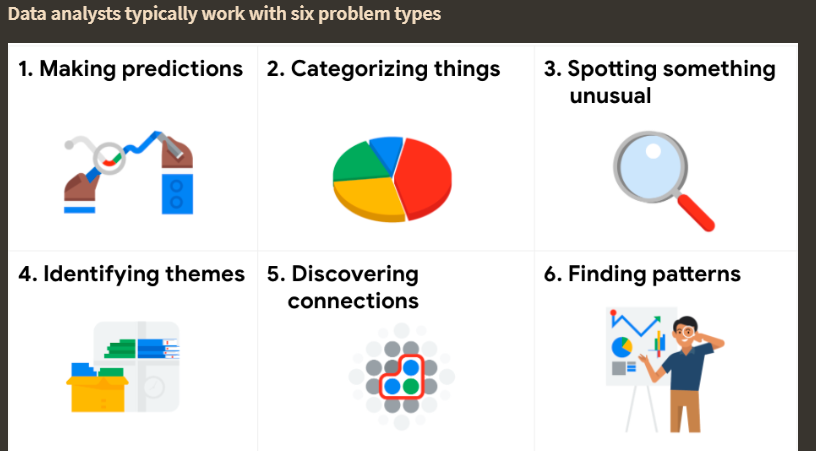
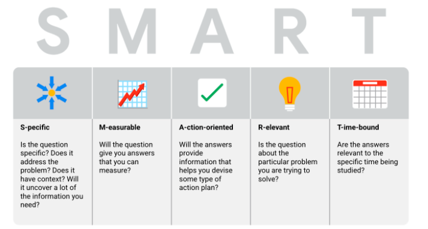
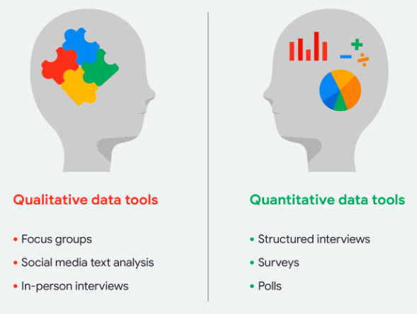
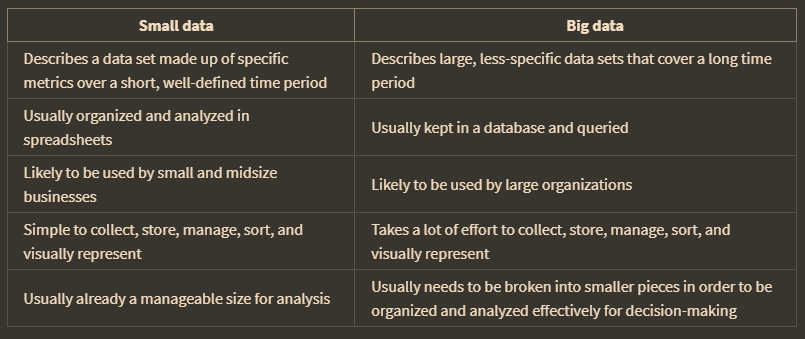
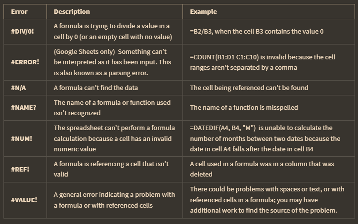
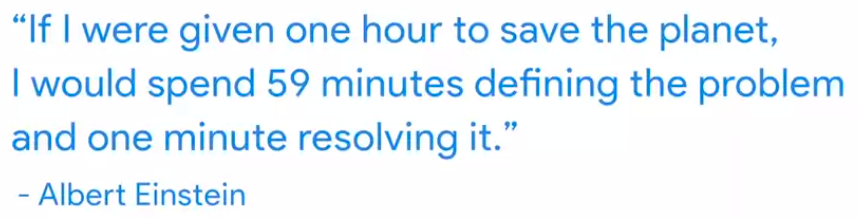
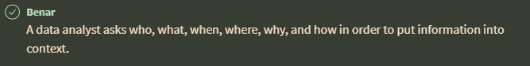
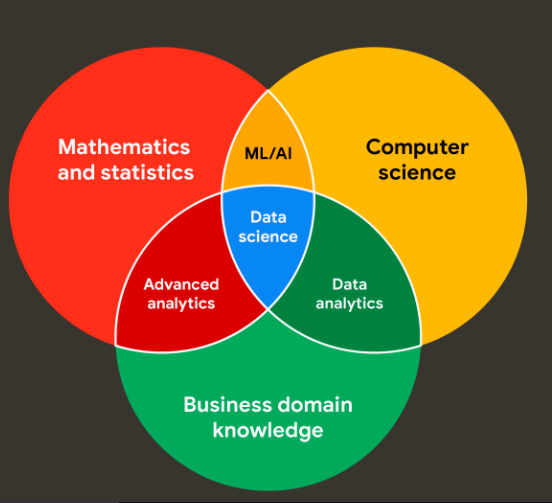
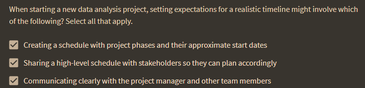

SMART Question

data life cycle: plan, capture, manage, analyze, archive, and destroy.

## spreadsheet error code

## Working with stekeholder

perlu bekerja sama dengan ahli bisnis (stekeholder)

**communication is key**

Be sure to answer these four important questions related to your audience:

Who is your audience? 

What do they already know? 

What do they need to know? 

How can you best communicate what they need to know? 

yang pelu digarisbawahi : Balancing expectations and realistic project goals

## Limitation of data

