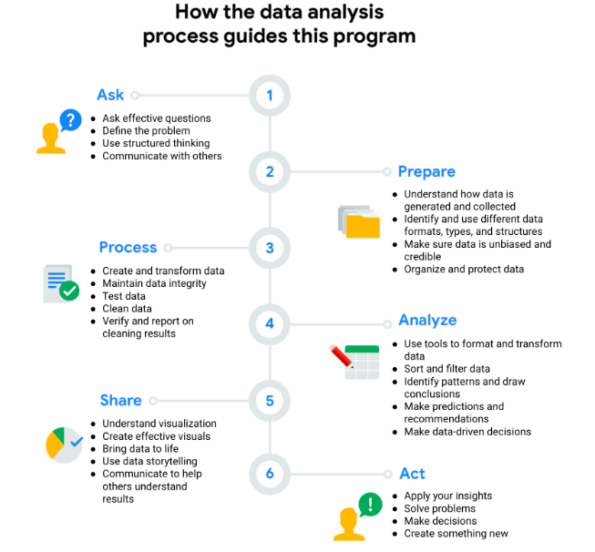

Data ecosystem is Elements that interact with one another in order to produce, manage, store, organize, analyze, and share data are data ecosystems. These elements include hardware and software tools, as well as the people who use them. 

n data analytics, the data ecosystem refers to the various elements that interact with one another to produce, manage, store, organize, analyze, and share data.

skill analitik 
kualitas dan karakteristik yang berhubungan dengan menyelesaikan masalah menggunakan fakta. 

data design, which involves how information is organized. 

>(A technical mindset) The analytical skill that involves breaking processes down into smaller steps and working with them in an orderly, logical way

Data visualisasi termasuk dalam charts, maps, and graphs
Gap analysis

## Variations of the data life cycle
Plan: Decide what kind of data is needed, how it will be managed, and who will be responsible for it.

Capture: Collect or bring in data from a variety of different sources.

Manage: Care for and maintain the data. This includes determining how and where it is stored and the tools used to do so.

Analyze: Use the data to solve problems, make decisions, and support business goals.

Archive: Keep relevant data stored for long-term and future reference.

Destroy: Remove data from storage and delete any shared copies of the data.

### 6 phases of data analysis
1. ask
2. prepare
3. process
4. analyses
5. share
6. act

During the process phase of data analysis, a data analyst cleans data to ensure it’s complete and correct.

n data-driven decision making, data analysts use five analytical skills of curiosity, understanding context, having a technical mindset, data design, and data strategy