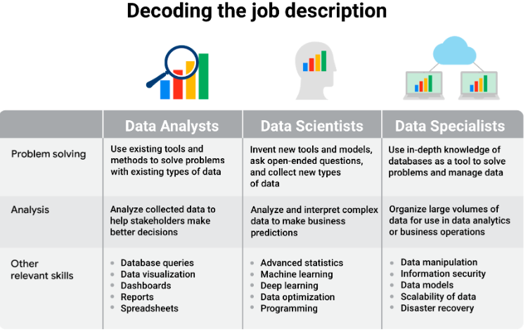

1. spreadsheet
2. popular Structured Query Language (SQL) programs include MySQL, Microsoft SQL Server, and BigQuery.
3. Visualisation : tableau and Looker

t method involves asking multiple questions in order to get to the root cause of a problem is 5W ( What, Who, ...)

When a choice is made between good, bad, or a combination of consequences based on facts, it is also known as data-driven decision making 

atribut adalah misalnya 'kota', dan lain lain

analisis sayuran dipasar, ketika anda tidak mempunyai data tentang bawang merah, sehingga anda mengecualikan bawang merah dalam analisis sayuran di pasar. itu akan meningkatkan bias data