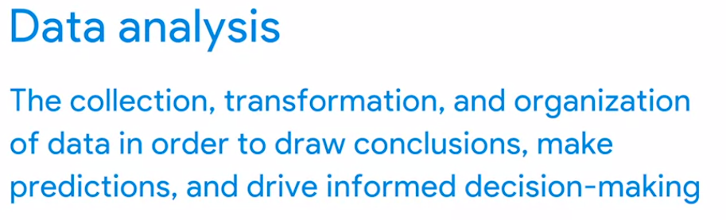
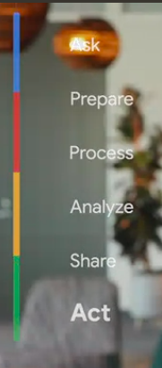
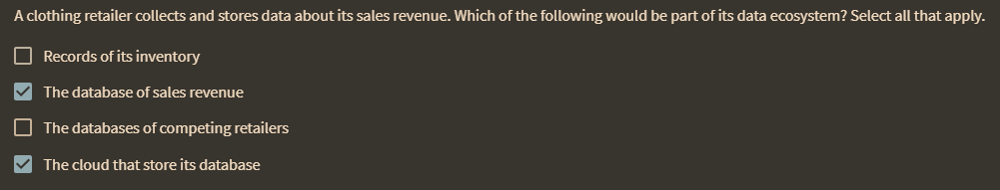
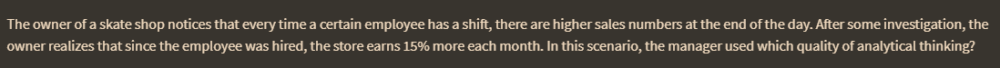
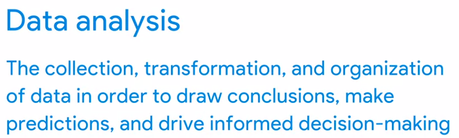

Data adalah kumpulan fakta.

Data analytc is science of data. dari data dapat digunakan berbagai aplikasi, misalnya hukum, pengembangan produk, komunikasi konsumen dan lain sebagainya

Curiosity, understanding context, having a technical mindset, data design, and data strategy are analytic skills

tambah record investorinya.

jawabanya adalah korelasi 

Here at Google, all of our products are built on data and data-driven decision making. misalnya kebanyakan morning person adalah sukses, dari data dianalisis patternnya.

Every minute of every hour of every day, more data is being created. Businesses need a way to control all that data so they can use it to improve processes, identify opportunities and trends, launch new products, serve customers, and make thoughtful decisions.

