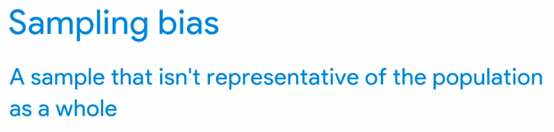
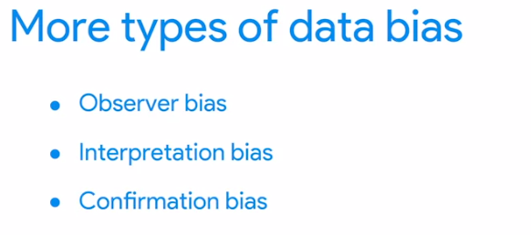
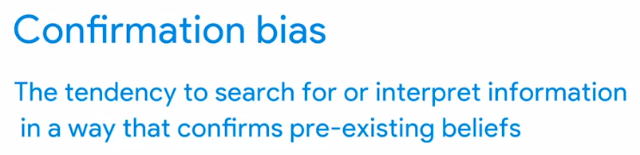
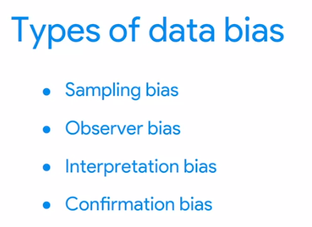
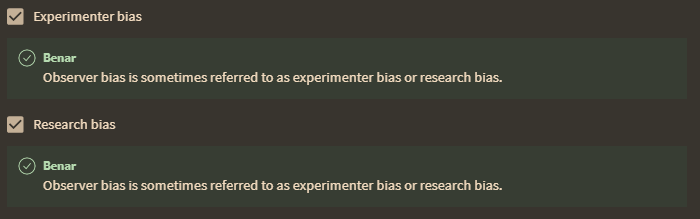
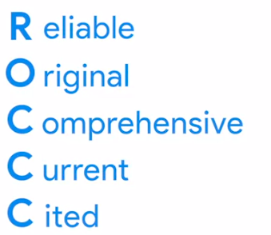
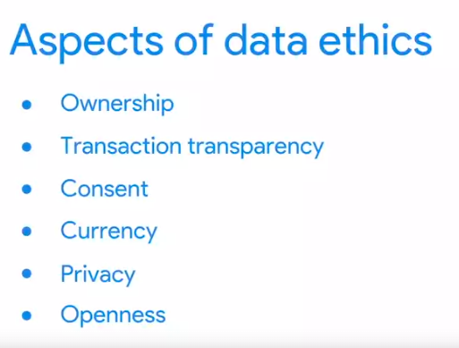
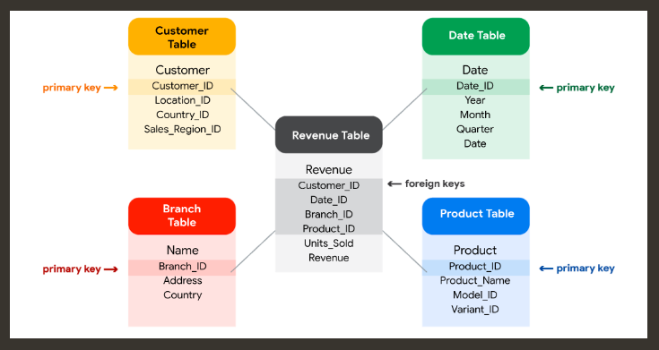
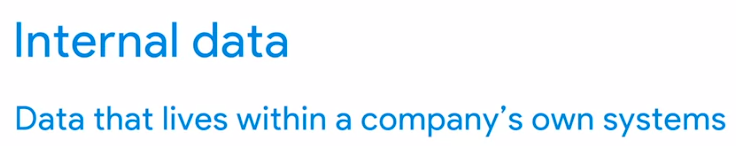

below describing observer bias. 

data yang jelek tidak memenuhi kriteri dibawah ini

## Etika Data

jika anda ingin mengambil data nomor kredit karyawan anda anda tetap harus izin terlebih dahulu.

type of bias is the tendency to always construe ambiguous situations in a positive or negative way is interpretation

masalah foreign key dan primery key. foreign key bisa lebih dari satu dalam satu tabel

### BigQuery
is a data warehouse on Google Cloud that data analysts can use to query, filter large datasets, aggregate results, and perform complex operations. 

### Metadata