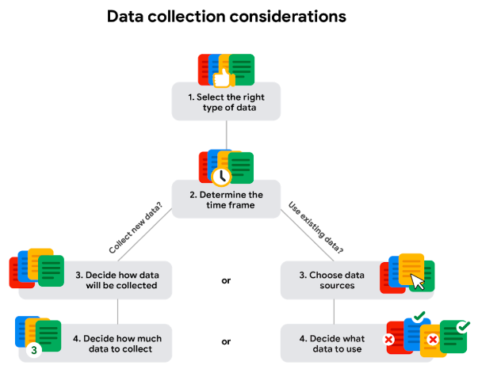
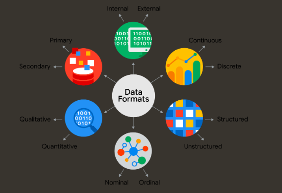
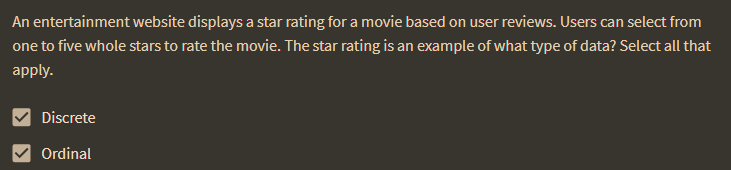
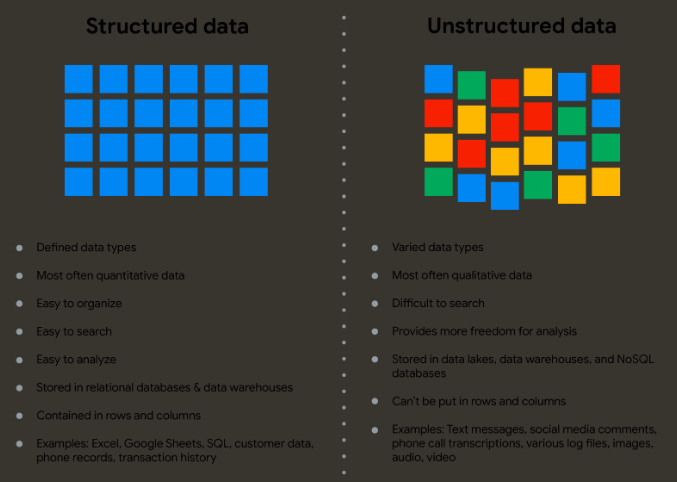
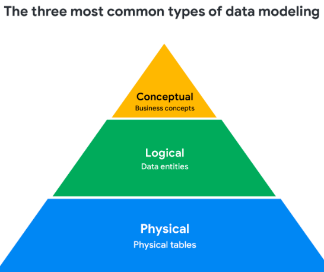

> info speedrun

To track people's online activities and interests, cookies are most effective

A sample is a part of a population that is representative of that population. 

Observation is the method of data-collection most often used by scientists.

External data is particularly valuable when an analysis depends on as many sources as possible.

### data transformation

Using random sampling during data collection helps ensure unbiased sampling. 