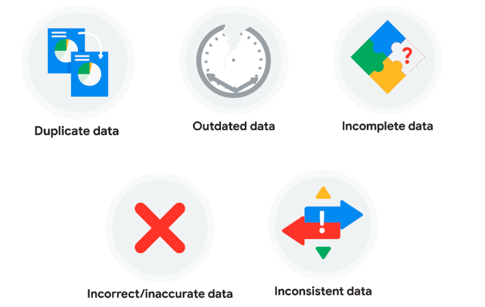
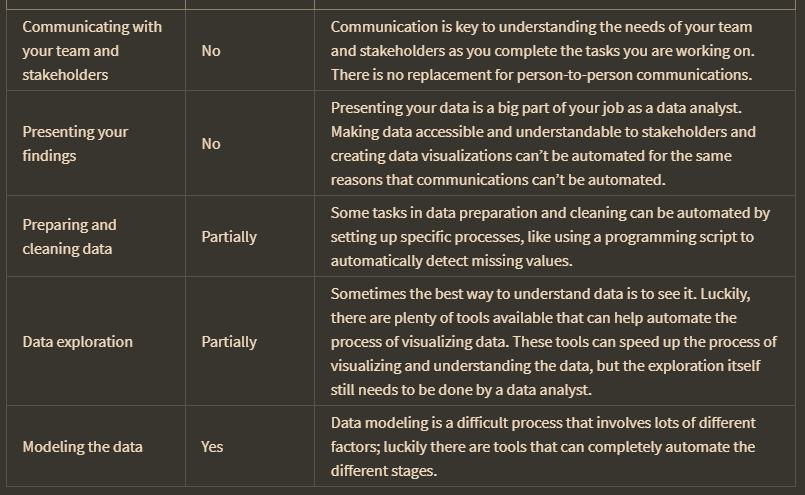

Data validation is a cleaning feature to check the accuracy and quality of data before adding or importing it.

berikut adalah kesalahn umum dalam membersihkan data yang kotor

hal-hal yang dapat di otomasi dalam pengolahan data

>different data perspective?

contoh cleaning tool adalah: data validation, conditional formatting, COUNTIF, sorting, dan filtering