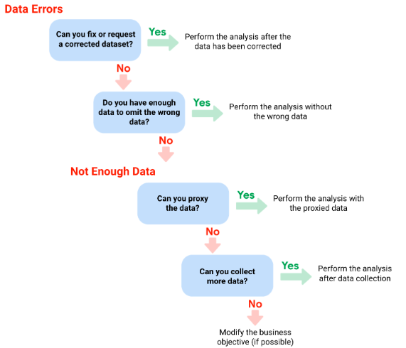
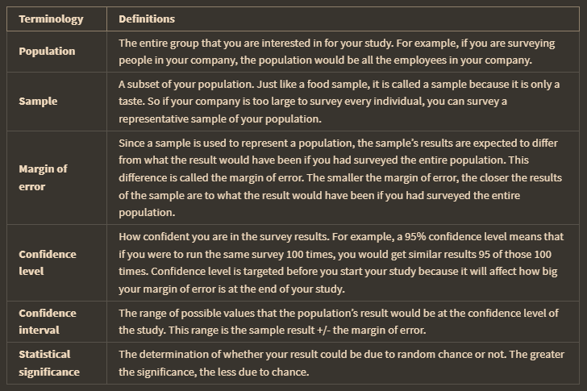
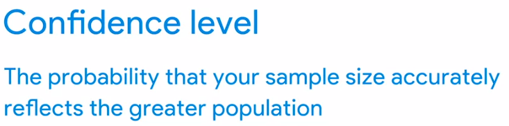
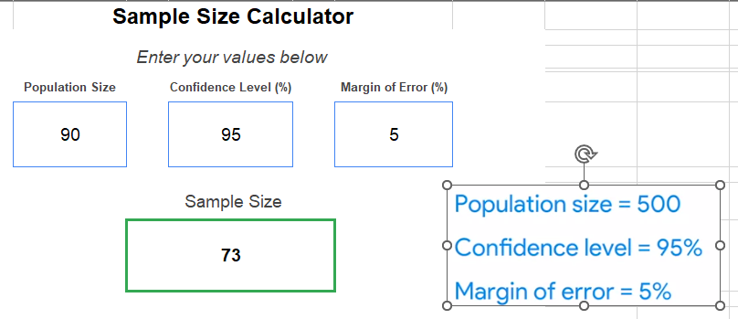
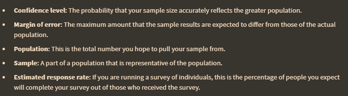
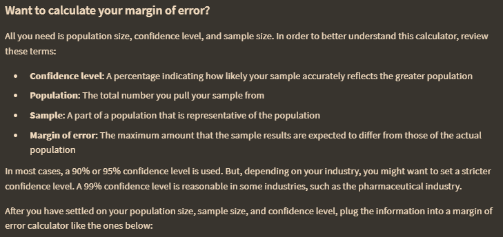
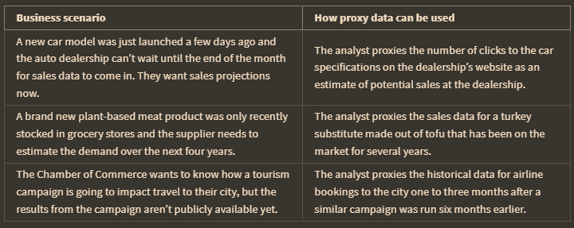

 process do data analysts use to make data more organized and easier to read is data manipulation. If you have insufficient data, you can identify trends with the data that is available and qualify your findings accordingly.
 
 
 
 sample size : a part of populatiopn that is representative of the population. itu penting mengingat bahwa using 100% of a population is expensive.  
 
 beberapa terminologi dalam ukuran sampel
 
 
 # Determine the best sample size
 
## statictical
A 0.8 or 80% statistical power is typically considered the minimum for statistical significance.

having a 99% confidence level is ideal, but most industries hope for at least a 90% or 95% percent convfidence level

## margin of error

Margin of error is the maximum amount that the sample results are expected to differ from those of the actual population. 

In a survey about a new cleaning product, 75% of respondents report they would buy the product again. The margin of error for the survey is 5%. Based on the margin of error, The percentage range reflects the population's true response is **Between 70% and 80%**

## scenario
