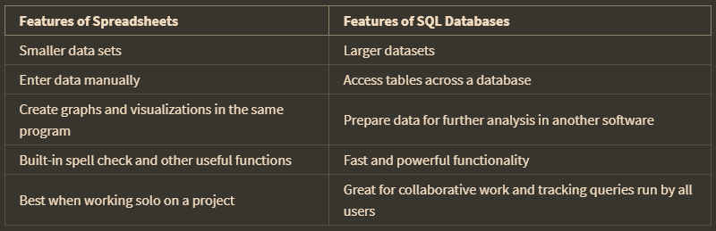
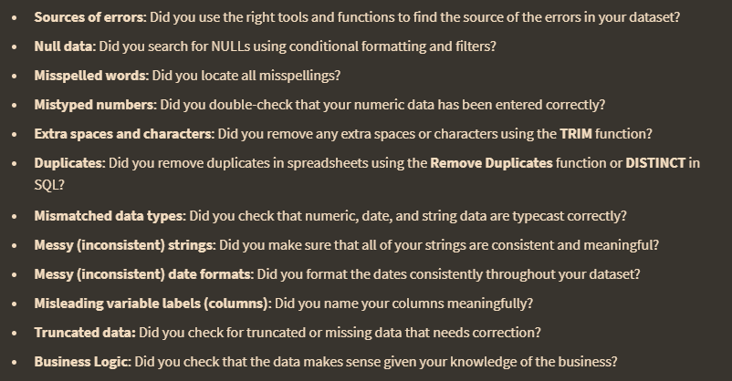
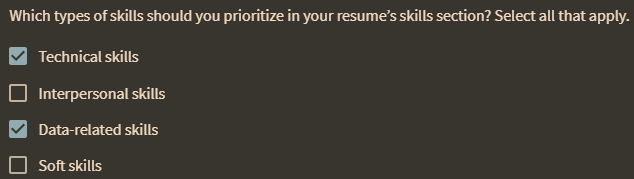
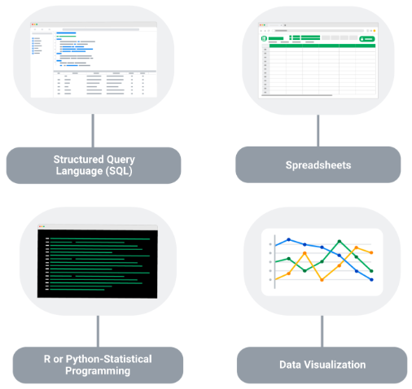
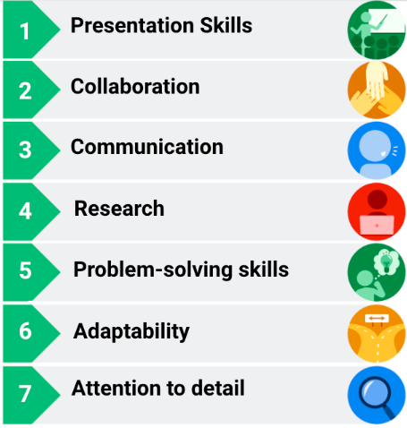

SQL can process large amounts of data much more quickly than spreadsheets. berikut adalah perbedaan diantara keduanya

Data analysts use the CONCAT function to add strings together and create new text strings for unique keys.

contoh queri SQL untuk cleaning data 

	SELECT 
	*
	FROM
	customer
	WHERE LENGTH(country) > 7
	
	
Data verification :  a checklist

# Resume or CV

kemampuan umum yang biasanya ada di data analis

