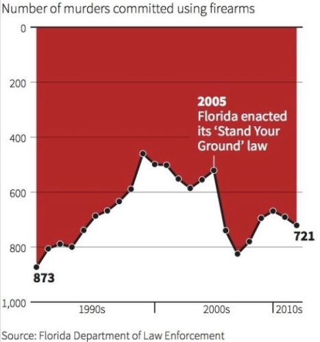
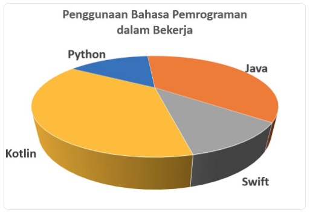
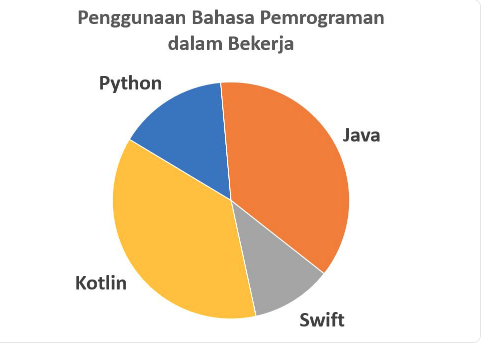
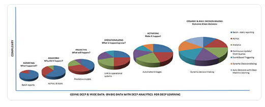

1. nilai presentase tidak sesuai, bisa saja terbaik atau kesalahan lainya
2. terlalu banyak data 
3. tidak mengikuti kaidah kepenulisan yang baik
4. terdapat sumbu yang terpotong
5. representasi 3D yang salah
6. susah dibandingkan 

*terlalu banyak data*

*tidak mengikuti kaidah kepenulisan (terbailk: 0 diatas)*

*representasi dalam bentuk 3D, terlihat python lebih kecil dari swift*

*sebenarnya yang terjadi*

*contoh diagram yang susah dibandingkan*
