## berbentuk teks
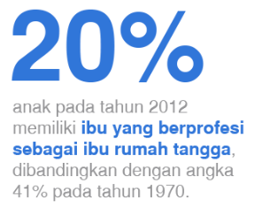

## tabel
Tabel sangat baik ketika audiens Anda beragam karena mereka dapat membaca baris tertentu sesuai kepentingan masing-masing. Jika kita berhadapan dengan banyak unit pengukuran, tabel lebih memudahkan saat dibaca. 

Perlu diperhatikan jika dalam membuat tabel dalam presentasi untuk menghindari penggunaan garis tepi yang tebal atau bayangan karena mengakibatkan audiens untuk salah fokus

## Heatmap
Grafik ini berfungsi untuk memvisualisasikan data melalui format tabulasi yang memanfaatkan pewarnaan dalam sel untuk menunjukkan besaran nilai angkanya.

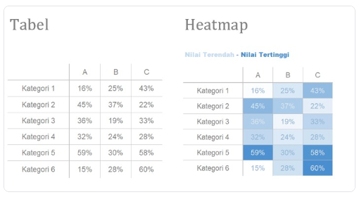

Pada tabel biasa kita harus mengamati tiap baris dan kolom untuk memahami data mana yang lebih besar atau lebih kecil dibandingkan lainnya. Untuk mengurangi proses dalam memahami data, gunakan saturasi warna sebagai penanda visual. Kategori warna pada tabel heatmap sebelah kanan membuat proses mencari informasi lebih mudah dan cepat karena jika kita ingin mencari data yang persentasenya paling besar dapat mencari saturasi warna yang paling gelap.

## Grafik
Grafik yang digunakan umumnya terbagi menjadi empat kategori : Titik, garis, batang, dan area.

### Kategori Titik
> scaterplot

scatterplot berguna untuk menunjukkan hubungan antara dua hal yang terdapat di sumbu x dan y karena grafik ini membuat kita memproses data serentak untuk melihat hubungan apa yang muncul. Meski jarang digunakan, dunia bisnis masih ada yang menggunakan scatterplot.

pengelolaan armada bus dan ingin memahami hubungan antara jarak yang ditempuh dan biaya per kilometer

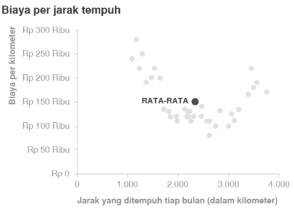

sedikit memodifikasi agar terlihat lebih menarik
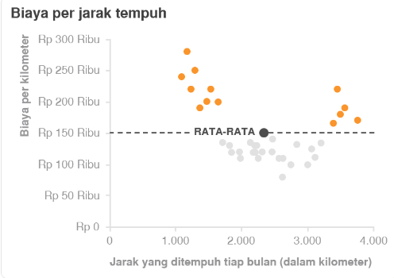
bahwa didapat  biaya per mil lebih tinggi dari rata-rata ketika jarak tempuh kurang dari 1.700 km atau lebih dari 3.300 km untuk sampel yang diobservasi.

### kategori garis

> grafik garis

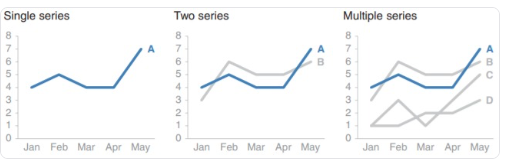

> slopegraph

Slopegraph hanya memperlihatkan perubahan antara dua titik saja. Hal tersebut bertujuan agar audiens fokus pada perubahan kenaikan atau penurunan yang terjadi.
Bayangkan kita menganalisis dan mengkomunikasikan data dari survei karyawan. Dari hasil analisis tersebut menunjukkan perubahan dalam kategori survei dari 2014 hingga 2015 seperti berikut

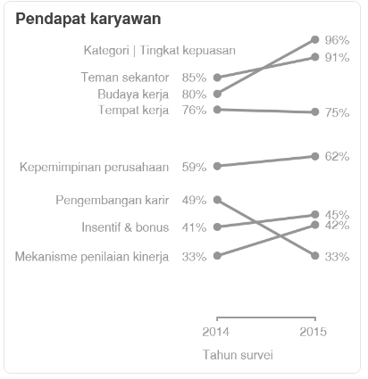

### kategori batang

> grafik batang vertikal

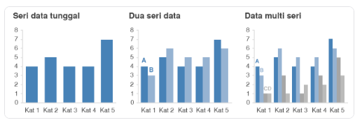

perlu dicatata jika seri data yang ditambahkan semakin banyak, semakin sulit audiens untuk fokus membaca dan menarik kesimpulan. Alternatifnya, gunakan grafik multi seri

> grafik batang bertumpuk

penggunaannya lebih terbatas. Grafik ini memungkinkan kita untuk membandingkan antar kategori utama dan juga antar sub komponen dalam tiap kategori. Namun, grafik ini dapat membuat audiens kebingungan secara visual
 
 > grafik air terjun

dapat digunakan untuk menampilkan bagian tertentu dari grafik batang bertumpuk. Hal tersebut bertujuan untuk lebih fokus menunjukkan data awal, kenaikan atau penurunan yang terjadi, serta data akhir. dapat digunakan untuk studi kasus seperti berikut : Bayangkan kita adalah manajer tim SDM (human resource) yang diminta oleh direktur perusahaan untuk memperlihatkan bagaimana perubahan jumlah karyawan pada tim pemasaran.

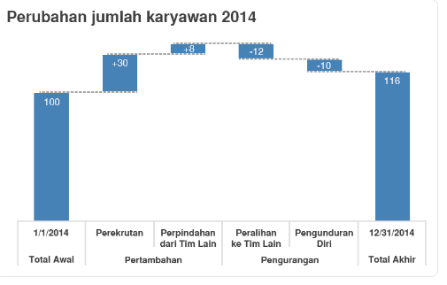

Di sisi kiri, kita melihat jumlah karyawan tim pemasaran di awal tahun. Seraya kita bergerak ke arah kanan, kita melihat pertambahan dari perekrutan karyawan baru dan perpindahan dari tim lain ke dalam tim pemasaran. Pertambahan ini diikuti dengan pengurangan: peralihan karyawan ke tim yang beda dan pengunduran diri karyawan dari perusahaan. Batang yang di ujung kanan merepresentasikan jumlah karyawan di akhir tahun, setelah pertambahan dan pengurangan yang telah terjadi.

> grafik batang horizontal 

Grafik ini sangat mudah dibaca untuk mengetahui kisaran sebuah data, khususnya jika nama kategori panjang. Selain itu, grafik ini cocok dengan kebiasaan mata kita memproses informasi mulai dari kiri atas (nama kategori) hingga ke kanan (data) 

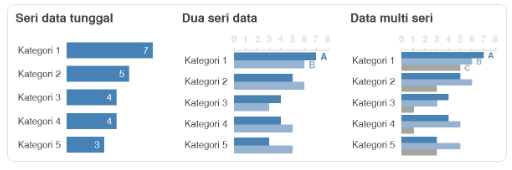

> Grafik Batang Horizontal Bertumpuk

dapat digunakan untuk memvisualisasikan porsi keseluruhan skala dari negatif hingga positif, karena kita menggunakan garis dasar yang konsisten baik ujung kiri maupun ujung kanan. Pendekatan grafik ini dapat terlihat cukup baik pada contoh data survei di bawah ini.

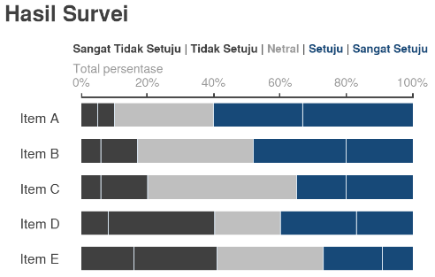

### kategori area
Salah satu kategori grafik yang sering dihindari adalah jenis area karena mata manusia tidak terbiasa untuk menghubungkan data kuantitatif dengan bidang dua dimensi. Hal ini menyebabkan grafik area lebih sulit dibaca daripada grafik-grafik sebelumnya. Untuk alasan ini, hindarilah grafik area kecuali ketika ingin memvisualisasikan data yang besaran perbedaan angkanya sangat tinggi

diceritakan bahwa dari 100 pelamar, 25 dipanggil interview, dan 9 diterima sebagai karyawan. Setiap pelamar divisualisasikan sebagai satu area kotak kecil. Dikarenakan perbedaan nilai data sangat tinggi (100 lawan 25 lawan 9) maka visualisasi area ini terlihat cantik dan mudah dicerna. Kehadiran dua dimensi dari grafik ini memungkinkan kita menampilkan data lebih ringkas dibandingkan dengan satu dimensi.

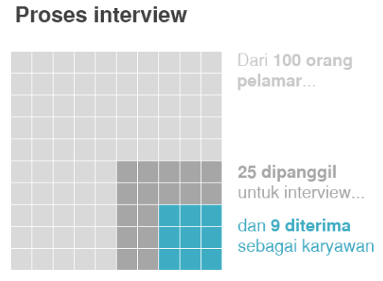

