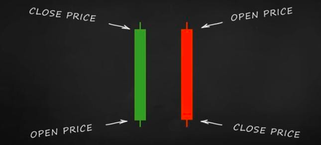
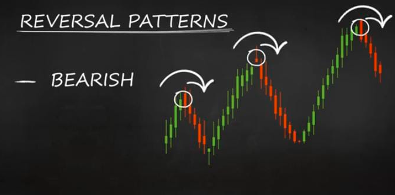
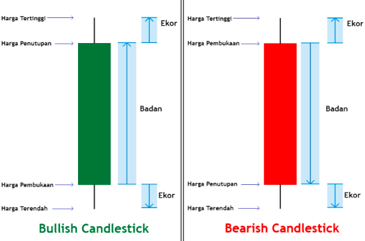

Satu candlestick memuat informasi tentang harga pembukaan (open price), harga penutupan (close price), harga tertinggi (high price) dan harga terendah (low price). satu candle stick mewakili interval waktu, misal satu candle stick untuk 10 menit

Dalam satu periode, 
- open price, harga terawal ketika periode baru dimulai
- high price, harga tertinggi ketika periode  berlangsung
- low price, harga terendah ketika periode berlangsung
- closed price, harga terakhir ketika periode sudah selesai

bullish atau green candle stick terjadi ketika harga close lebih tinggi daripada harga open

maka sebenarnya ketika ada pola seperti ini, apabila intervalnya di luaskan, akan terjadi bearish (green candle stick).

Bagaimana merepresentasikan candle stick sebagai singal?

secara umum, ketika candlestick memiliki shadow yang panjang, ini **menandakan ada volume transaksi yang besar** pada satu periode. shadow panjang ini terbentuk dari harga yang pernah naik atau turun kuat lalu berbalik dengan cepat. Dapat juga direpresentasikan sebagai **volatilitas yang tinggi** pada transaksi seller dan buyer.