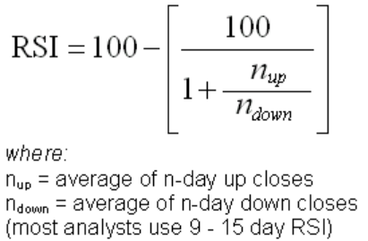
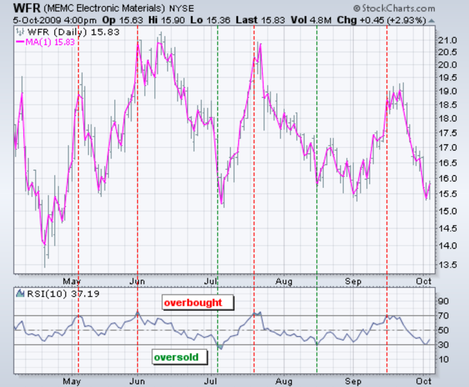
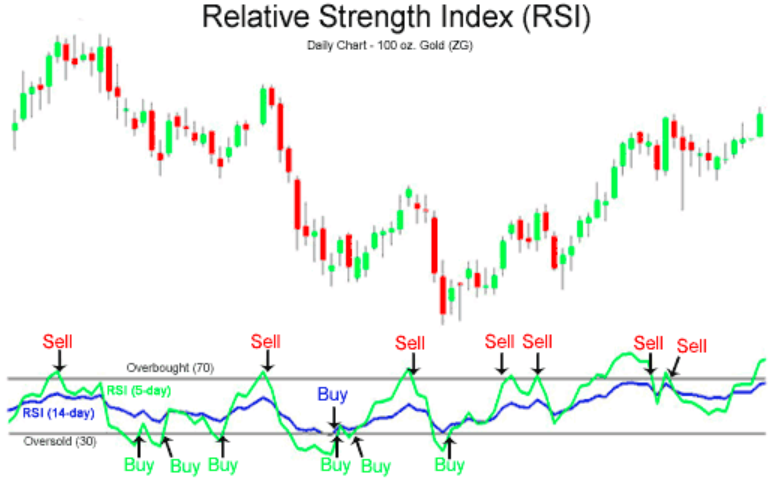

## Relative Strenght Indicator
merupakan salah satu indikator yang memiliki parameter osilasi alias sebagai oscillator. Indikator ini dipakai untuk dapat menilai bagaimana kekuatan dan arah gerak dari tren harga saham tertentu. tergolong sebagai indikator teknikal yang bersifat leading atau mendahului harga saham yang bergerak. Sinyal yang didapatkan relatif lebih cepat sehingga kerap digunakan untuk analisis pasar dalam jangka waktu singkat hingga menengah.

> Secara garis besar, indikator ini dapat menjadi penanda saham yang oversold maupun overbought.

dikatakan overshold apabila berada diatas kurva berada diatas 70%, dikatakan overbought ketika berada dibawah 30%.

> Ketika nilai RSI di atas 70, pasar dianggap overbought (jenuh beli) yang berarti harga saham sudah terlalu mahal dan berpotensi untuk bergerak turun (koreksi). Jika nilai RSI berada di bawah 30, pasar dianggap oversold (jenuh jual) yang berarti harga saham sudah murah dan akan berpotensi naik atau mengalami rebound.

Periode waktu yang biasanya digunakan adalah 14 hari, tetapi bisa disesuaikan.

Perhitungan RSI menggunakan persamaan dibawah 

*contoh penerapan*

Kondisi jual dan beli ideal menurut indikator tersebut adalah ketika grafik akan keluar dari area overbought ataupun oversold
