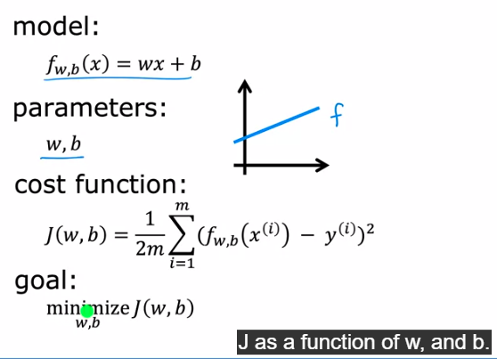
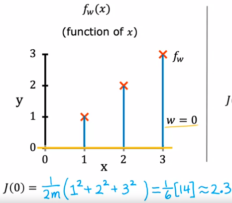
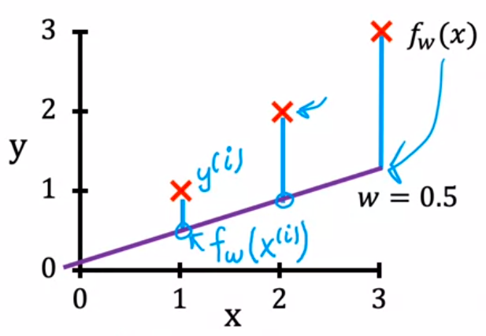
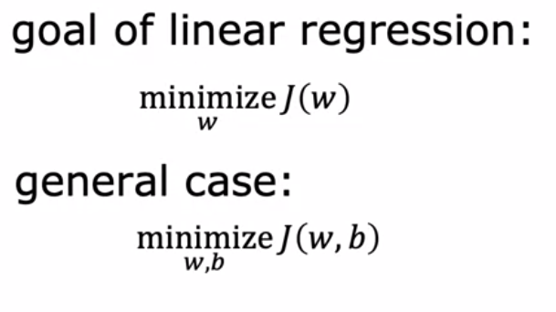
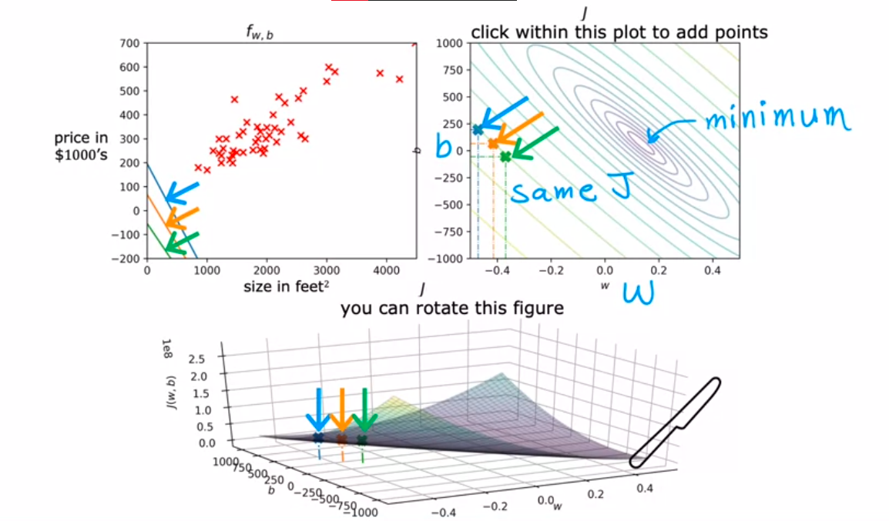
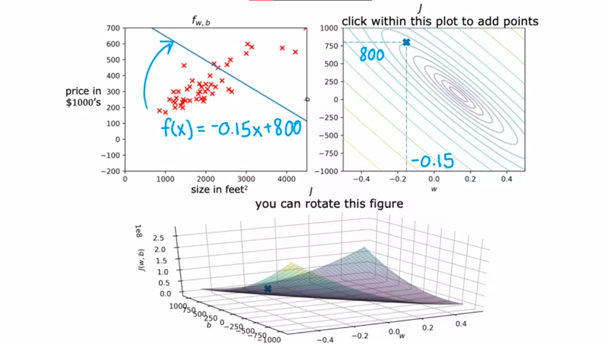
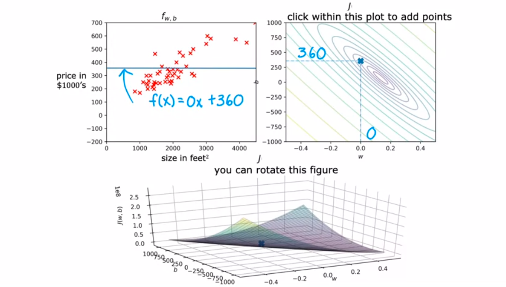
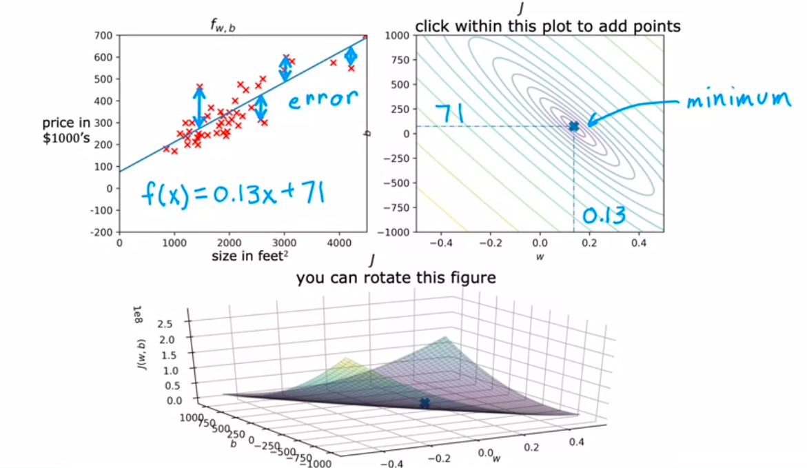

jadi untuk mengukur parameter w dan b dari nilai yang telah anda tentukan anda dapat menggunakan cost function. 

the goal is make J be as small as possible. 

misalkan input adalah 0

maka garis exacly bergabung dengan sumbu x. dan mari kita hitung cost function dengan input 0. J(0) dihitung seperti diatas dan didapatkan nilinya 2.3. begitu pula jika kasusnya garis agak keatas yaitu dengan input w = 0.5

> w akan memengaruhi kemiringan (slope) sedangkan b akan mengangkat garis kearah bawah atau atas. 

# Visualisasi cost function

contoh lainya. 

ketika anda menarik dari node data (merah silang) ke garis gradian untuk grafik kiri, itu sama saja anda menarik titik yang dibuat oleh angka -0.15 dan 800 di grafik kanan, titik itu kemudian ditarik garis ke pusat lingkaran (minimum). contoh lainya yang memiliki fits lebih baik. 
. hampir!

**algorithm to automatiaclly finding the values of parameter w and b they give uou the best fit line that minimizes the cost function J, Algoritma itu dinamakan Gradien Descent. Algoritma ini adalah algoritma sangat penting dalam machine learning. Gradient DEscent dan variations tidak hanya digunakan dalam regresi linear, tetapi tetapi banyak digunakan dalma model machine learning yang komplek**