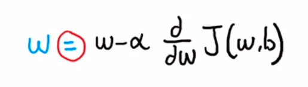
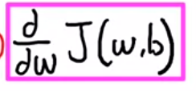
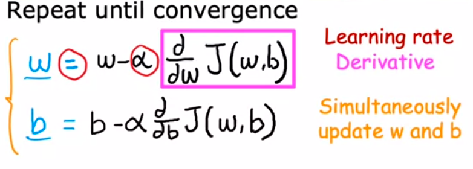
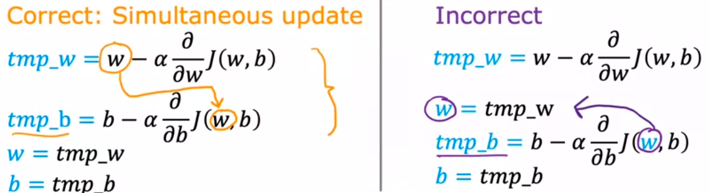
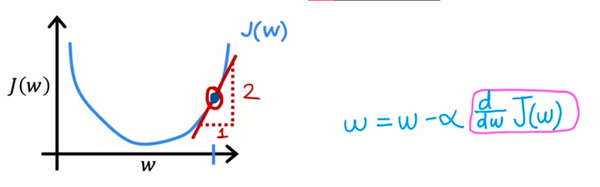
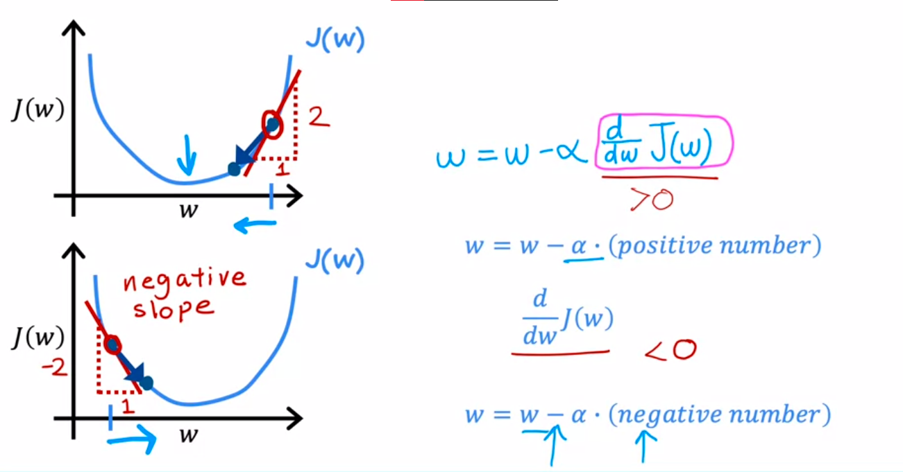
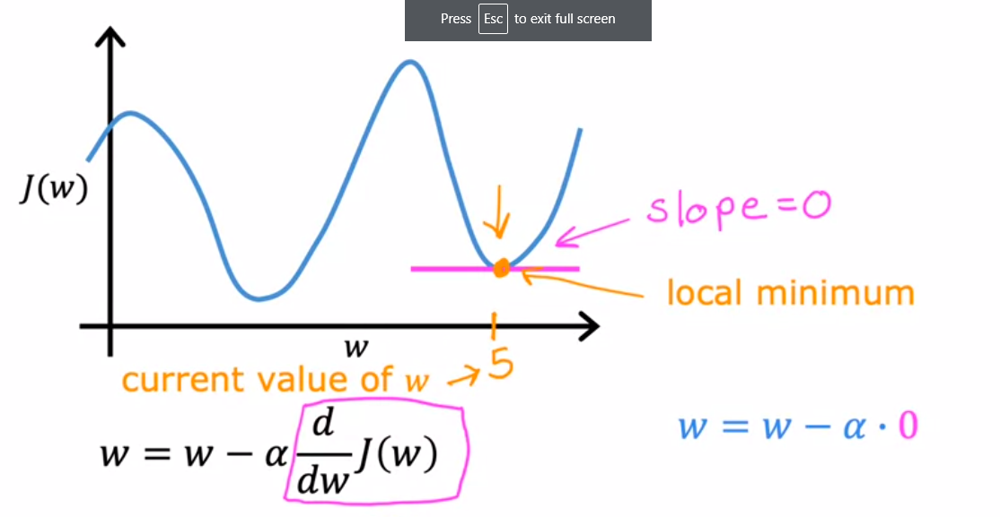

alfa disebut dengan learning rate

learning rate bernilai antara 0 sampai dengan 1. yang dilakukan alfa adalah how big step you take downhill. ketika alfa rate anda cenderung besar, maka gradient descent cenderung agresive. 

sedangkan dibawah ini adalah turunan

dua parameter dalam model adalah w dan b, yang akan diubah dari w dan b lama menjadi w dan b baru sampai dengan konvergen (getting bottom surface). 

seperti PID yang kau pelajari selama KKCTBN ASSD, dimana nilai lama dimasukkan kedalam nilai baru. 

***
diatas menggunkaan multivariete calculus right, and maybe it is partial differential, cause ada dua yaitu turunan terhadap w dengan b konstan, dan turunan terhadap b dengan w konstan, sehingga terdapat dua perasaman right. dalam intuisi saya ... nilai w akan dikurangi dengan turunanya. sehingga dia akan terus menerus mencapai curam surface (local minima), jadi jika sebaliknya, anda ingin naik ke surface (local maksimum) anda ubah tanda negatif alfa menjadi positif alfa, saya kira. kemudian alfanya sendiri sudah keliatan akan meingkatkan agresivitas dari turunan dengan mengalikanya that right. 

***
the exactly

so it will decresed, dan berlaku jika nilai turunan bernilai negatif

# Learning rate
jika nilai alfa (learning rate) terlalu kecil, bisa saja ia sampai pada local miminum tetapi memerlukan langkah yang banyak. jika nilai alfa terlalu bear, bisa saja ia mengalami overshoot sehingga bisa jadi tidak pernah mencapai localm miminum. 

gambar diatas memberikan alasan bahwa ketika titik sudah mencapai local minimum ia akan berhenti, hal itu disebabkan ketika titik berada pada local mimum maka ia berada pada keadaan stasioner, dimana turunan pada fungsi tersebut menghasilkan angka nol. oleh karena menghasilkan angka nol maka `w = w - a.0` mengakibatkan w baru dan w lama akan benilai 0 terus. 	

learning rate yang baik adalah ketika masih jauh dengan local mimum ia bernilai besarm tetapi kalau sudah dekat, automatically menurun. 