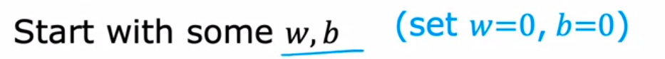
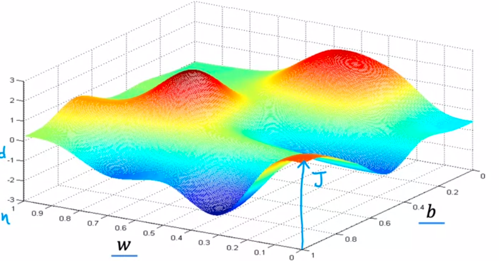
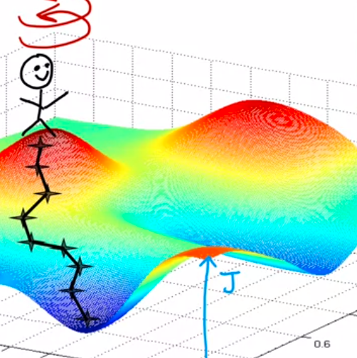

algorithm to automatiaclly finding the values of parameter w and b they give uou the best fit line that minimizes the cost function J, Algoritma itu dinamakan Gradien Descent. Algoritma ini adalah algoritma sangat penting dalam machine learning. Gradient DEscent dan variations tidak hanya digunakan dalam regresi linear, tetapi tetapi banyak digunakan dalma model machine learning yang komplek

ini juga dipakai dalam training Neural Network (NN) Models juga disebut sebagai deep learning models. 

Gradient descent digunakan untuk minimasi hampir semua fungsi, tidak hanya untuk cost function. 

misalnya J(w1, w2, w3, ... wn) adalah meminimasi J over paramter w1, w2, up to wn. 

for initial you can set w, b to 0

sumbu y adalah J(w, b). stepest gradient descent adalah bisa di analogikan seorang anak di puncak gunung, untuk ingin kebawah, ia akan berputar dan melihat keadaan sekitar, mana yang bisa saya turuni, setelah itu melihat lagi sekitar, dan menuruni, dan begitu seterusnya bisa sampai ke local minima. dinamakan multistep gradient descent 
