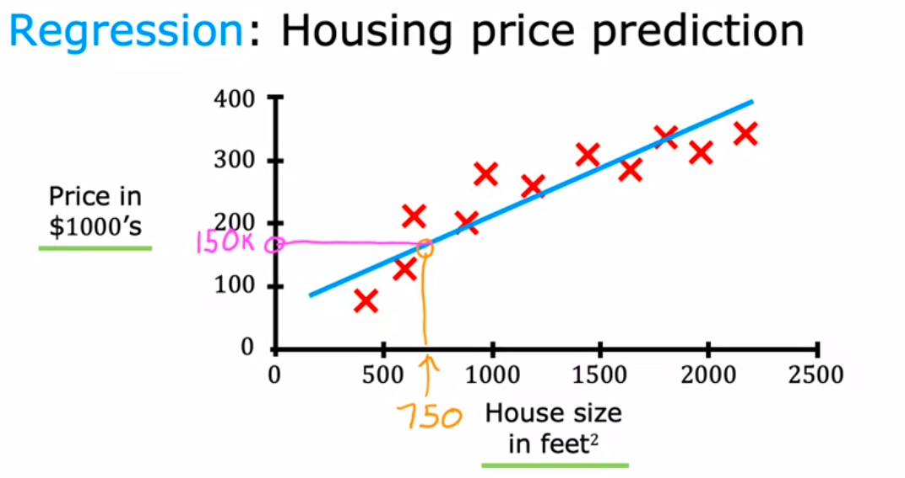
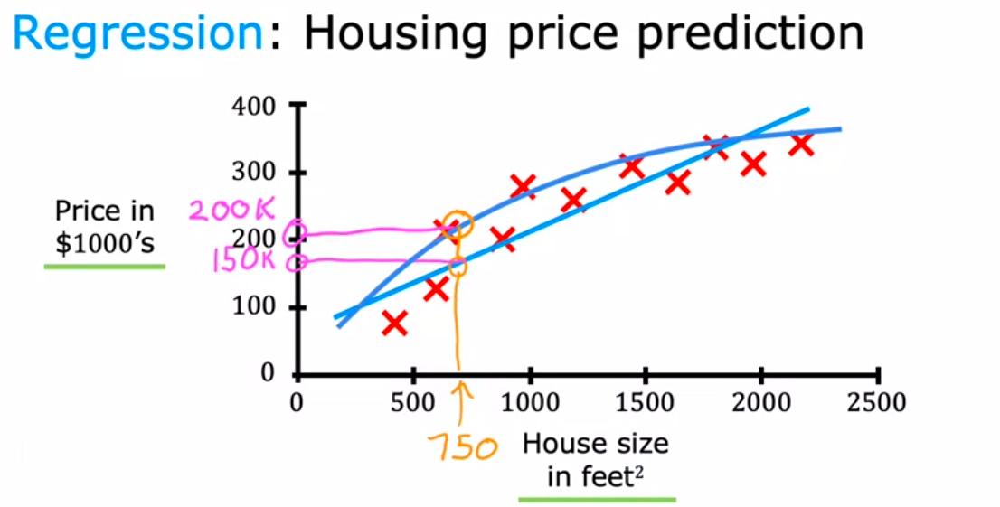
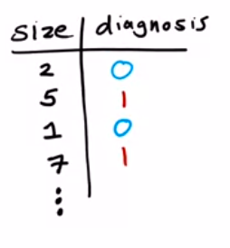
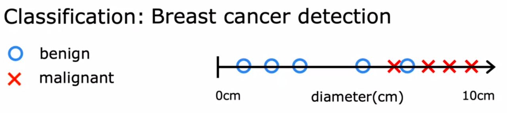
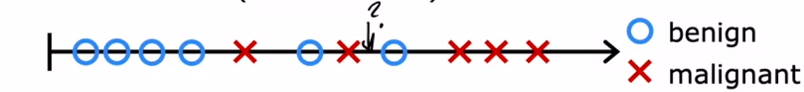
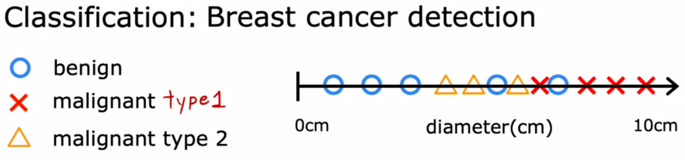
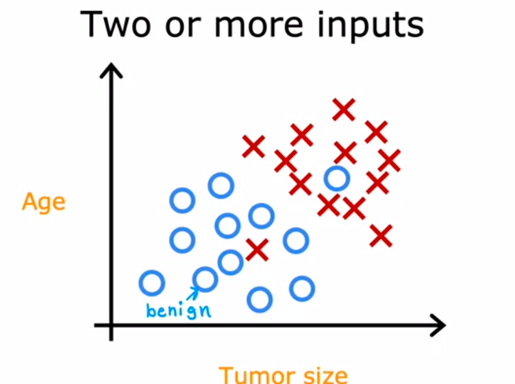
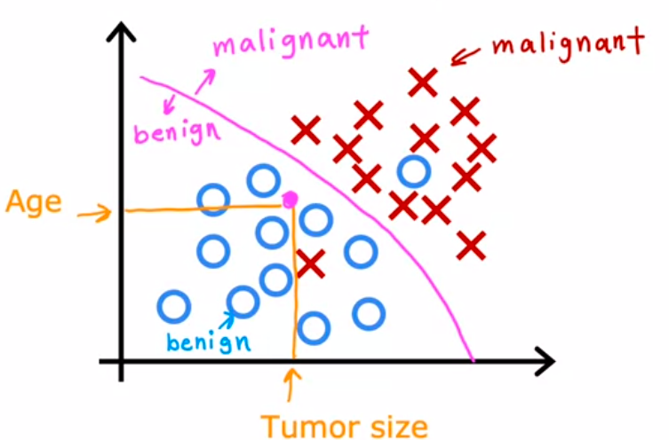

Supervised learning adalah yang sering digunakan dalam kehidupan nyata. supervised learning berkembang degan cepat. 

salah satu algorithmnya regression, yang bersifat kuantitatif

atau anda bisa mengoptimasinya dengan meningkatkan fitting

dibawah ini adalah supervised learning untuk klasifikasi, yaitu untuk mendektesi kanker apakah termasuk kanker ganas atau jinak.
data adalah berupa ukuran kanker dan klasifikasinya (sudah diketahui). data tersebut dinamakan juga labeled data

sehingga ketika di plot, akan nampak dibawah ini

pertanyaanya adalah bagaimana kita memprediksi untuk ukuran ini, termasuk kanker apakah itu

kita tambahkan kelas baru

sebelumnya kita hanya memiliki satu input saja, yaitu ukutan tumor. tetapi kita dapat menambahkan input lebih dari satu misalkan umur

lingkaran untuk kelas jinak dan silang untuk kelas ganas.
dalam kasusnya, ternyata kanker yang akan kita deteksi ditujukan oleh koordinat yang dibentuk titik orange. kita dapat menggunkaan algoritma klasifikasi seperti K-nearest untuk mengklasifikasikanya. 

