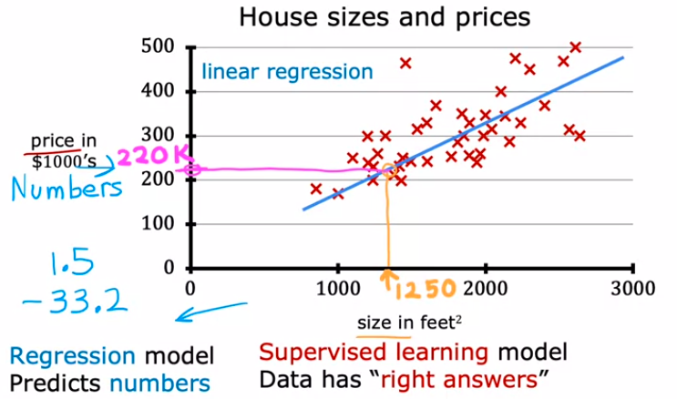
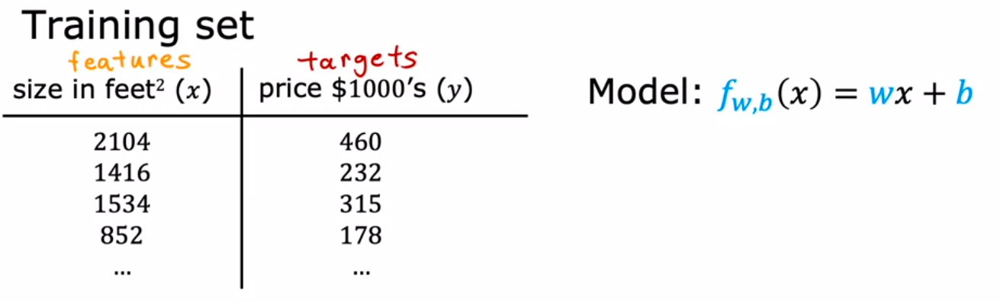
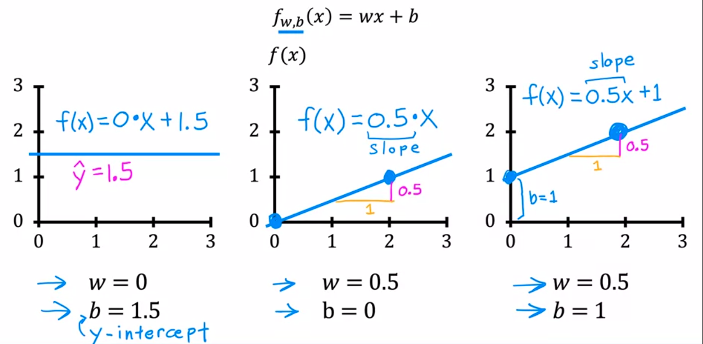
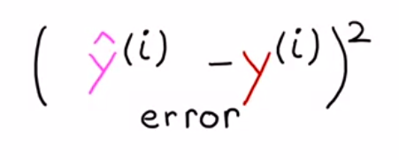
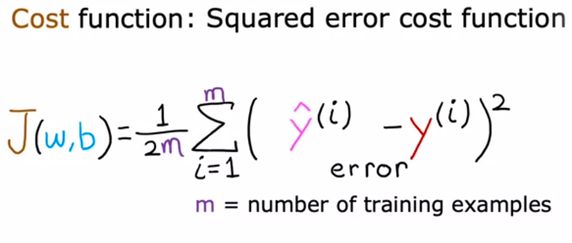
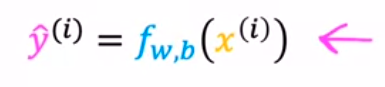
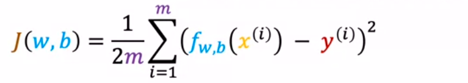

simpel eksempel

umunya dalam komunitas Machine learning, variabel input dinotasikan dengan variabel x, sedangkan untuk ouput adadalah y. seperti halnya notasi fungsi, f(x) = y. 

x^(1) sebagai input pertama, x^(2) sebagai input kedua and so on. 

dalam machine learning, fungsi dinamakan dengan **Model** dan ouput dari model adalah prediction yang direpresentasikan dengan notasi "y hat" (ŷ). 

notasi y hat (ŷ) adalah hasil prediksi model untuk input x baru, sementara y adalah nilai aktual dari output yang sesuai dengan input x tersebut

sepertin ini

jadi gampang saja, anda membuat regresi linear dari data, kemudian fungsi hasil regresi linear digunakan untuk menerima input dari data yang ingin anda prediksi (ŷ).

> anda dapat mengoptimasi (fit) fungsi regresi anda dengan meilih antara linear regresion, exponent regression and so on, dalam excel, akan ditujukan nilai R, semakin R mendekati 1, maka semakin bagus model tersebut. 

dalam training set, dikenal istilah berikut

w adalah intersept. mari kita variasikan w dan b

contoh yang pertama, paling kanan, apabila w adalah 0 dan b 1.5, maka berapapun inputnya, y hat akan berbilai 1.5. kemudian untuk contoh yang ketiga, apapun inputnya, ia akan didongkrak keatas dengan nilai b = 1. tugas kita adalah mencari nilai yang tepat untuk parameter w dan b sehingga model kita dapat mendekati hasil yang sebenarnya (traingin exampel / labelled data).

to do it, lets measure how well a line fits the training data. 	to do that we construct a **cost function**. const function ini mengukur perbedaan antara y dan y hat, menunjukkan seberapa baik model telah berhasil dalam mempelajari pola dalam data dan membuat prediksi yang akurat. dimana `(ŷ - y)^2`  atau dinamakan dengan error. 

huruf i menunjukkan data ke berapa. lebih lengkapnya tampak seperti ini, dinamakan dengan squared error cost function :

dalam aplikasinya, beberapa orang mungkin menerapkan rumus yang berbeda untuk aplikasi yang berbeda. tetapi rumus diatas adalah umum untuk linear regression. 

dapat disederhanakan dengan mensubstitusi y hat

