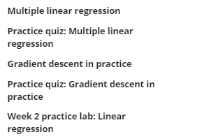
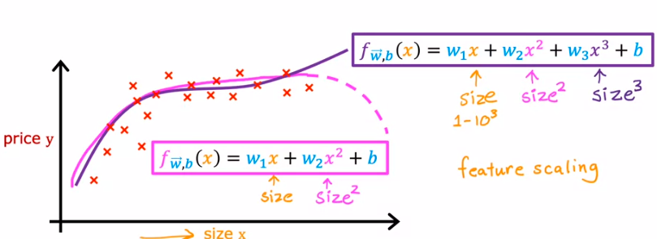
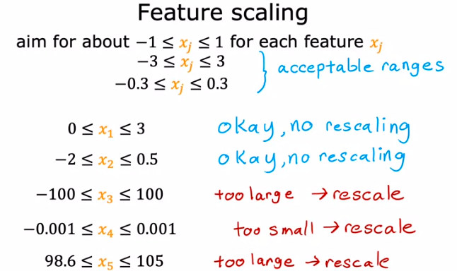

berisi secara garis besar sebagai berikut
 	

pada subbab 'gradient descent in practice' beberapa materi i am exited is 
1. choosing learning rate	
2. feature scaling
3. polynomial regression

kebutuhan scalling 
