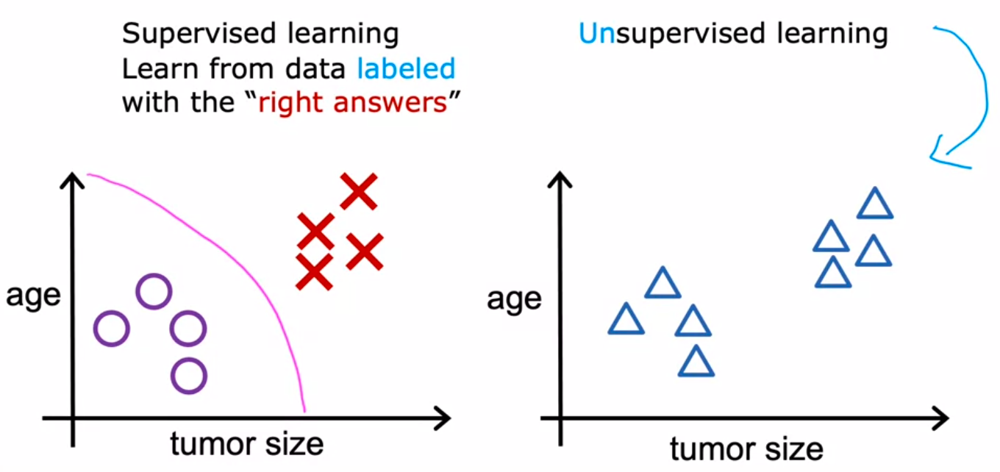
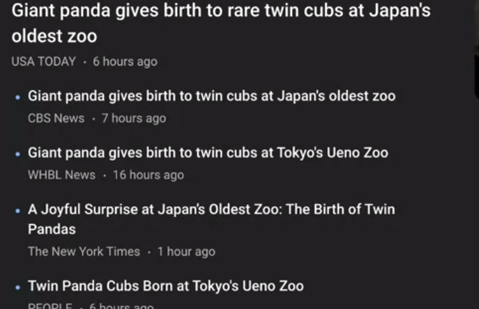
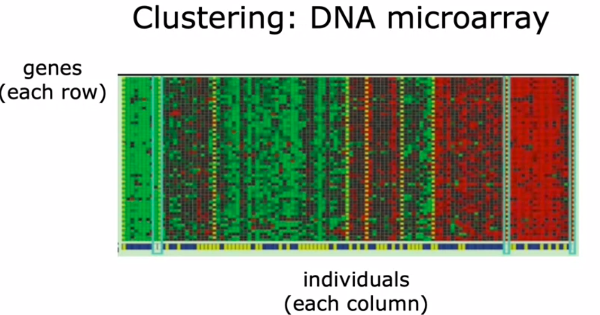
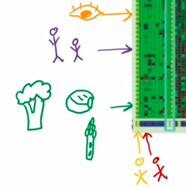
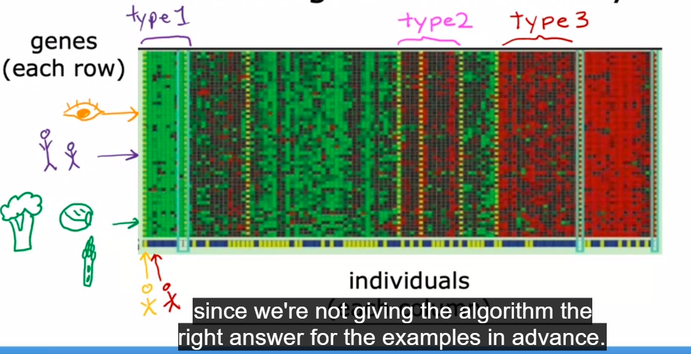
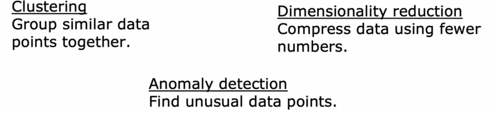

sebelumnya, pada supervised learning, deteksi tumor didasarkan pada data yang telah terlabeli (labelled data). maka untuk supervised learnign data data tersebut tidak dilabeli. 

maka yang dilakukan untuk unsupervised learning adalah mencari pola, atau mencari sesuatu yang unik. dia akan mengelompokkan data tersebut, dinamai dengan clustering. contoh penerapan dalam kehidupan adalah di algoritma google news, berita-berita dikelompokkan dimana setiap kelompok dalam berita tersebut memiliki kemiripan. 

di ilustasi diatas, mereka mengelompookan berdasarkan topik panda, twin dan zoo. sedangkan dibawah ini adalah contoh lainya

applied to clustering DNA data. each tiny colomn represents the DNA activity one person. 

misalnya dalam dua data DNA milik dua orang, di bagian yang ditujukan panah orange, dalam gen tersebut mengakibatkan warna mata, kemudian dibawahnya seberapa tinggi, dan dibawahnya adalah sifat tidak menyukai vegetarian, aktivitas gen yang tinggi ditandai dengan warna hijau, dan sebaliknya untuk warna merah. maka algoritma tersebut akan mengelompokkan, sebagai berikut

contoh lain, untuk satu orang ini adalah memilih ketiga-tiganya

# Unsupervised learning 2
pembagian unsupervised

imensionality reduction means that, lose data minimum as possible

> Umumnya, supervised learning digunakan untuk klasifikasi dan regresi, sedangkan unsupervised learning digunakan untuk klusterin

