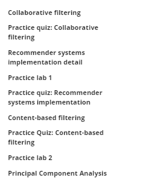
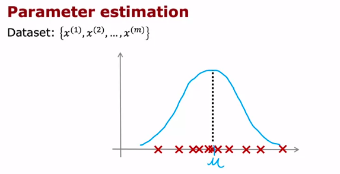
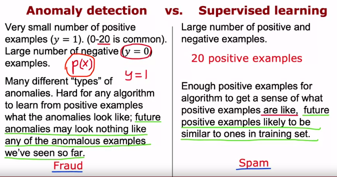
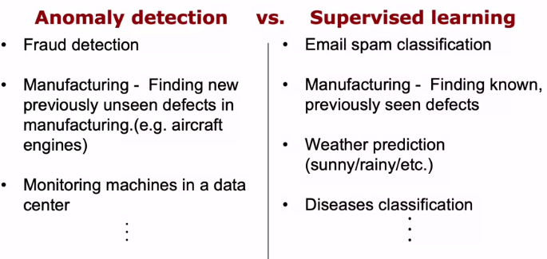
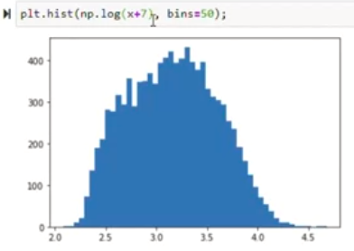
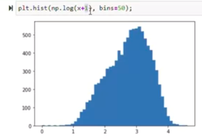
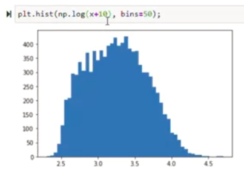
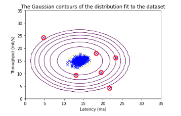

deteksi anomali dibahasa pada modul 2. by Andrew NG

### Supervised learning vs anomaly detection

Fraud (deteksi penipuan). Menemukan cacat baru yang sebelumnya tak terlihat di bidang manufaktur. 

You are building a system to detect if computers in a data center are malfunctioning. You have 10,000 data points of computers functioning well, and no data from computers malfunctioning. What type of algorithm should you use? : **Anomaly Detection**

You are building a system to detect if computers in a data center are malfunctioning. You have 10,000 data points of computers functioning well, and 10,000 data points of computers malfunctioning. What type of algorithm should you use? : **Supervised learning**

anda dapat memodifikasi algoritma sehingga diagram more like Gaussian

Pertanyaan #4
Anomaly detection flags a new input x as an anomaly if 
p(x)<ϵ. If we reduce the value of ϵ, what happens?
: The algorithm is less likely to classify new examples as an anomaly.

.ipynb exercise

