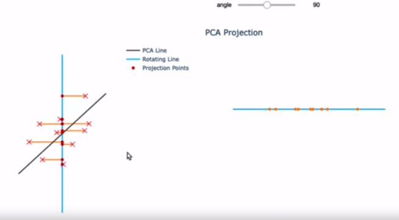
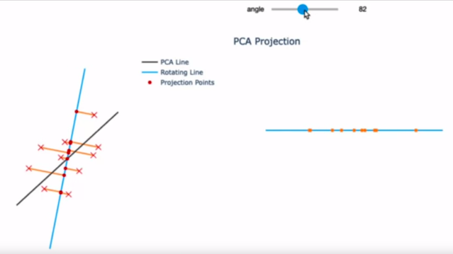
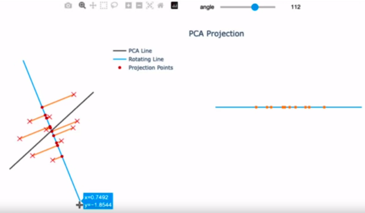
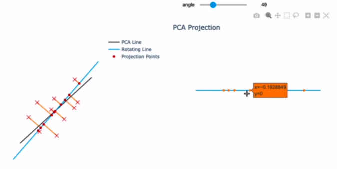
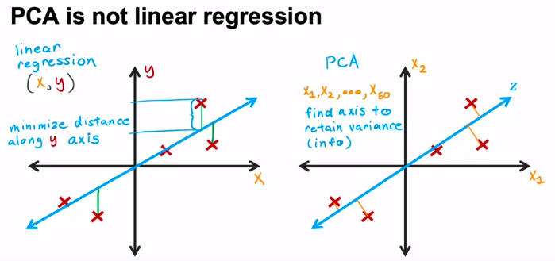
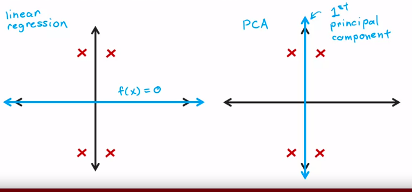
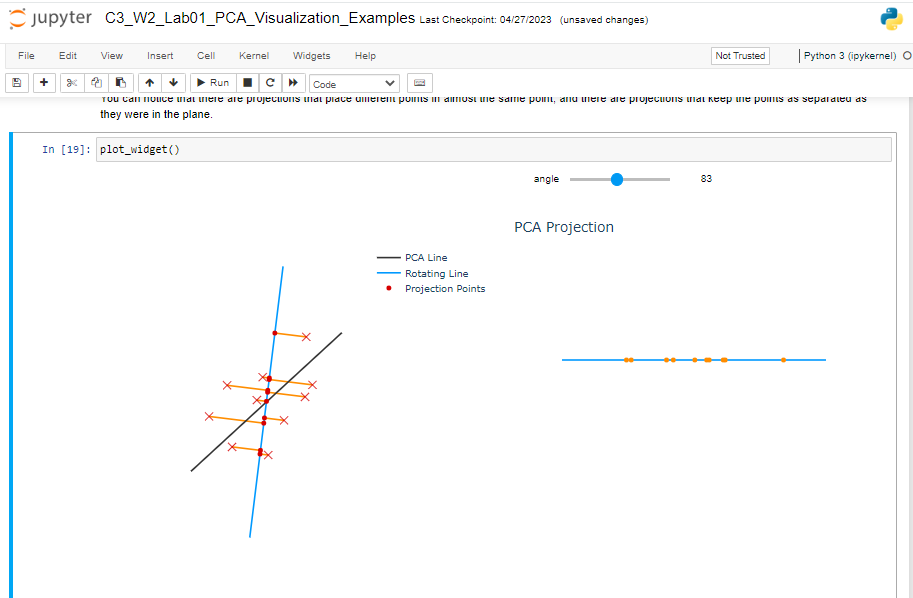

# PCA Algorithm
lihat bagaiaman mereka berubah seiring perubahan angle

## PCA is not linear regression

PCA (Principal Component Analysis)

Menurut saya, PCA ini adalah membuat garis, dimana garis itu akan 'menarik garis' dari setiap titik koordinat tersedia, dimana garis tersebut merupakan garis 'terpendek' dari garis induk ke setiap titik koordinat 
