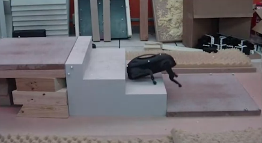
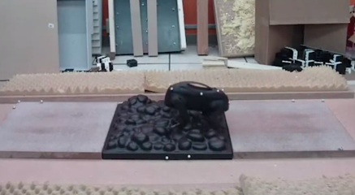
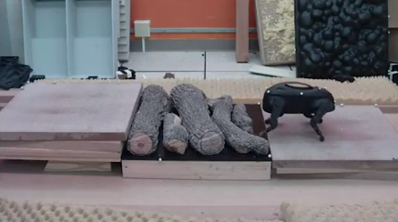

adalah pembelajaran mesin yang menyesuaikan dari lingkungan sekitar, contohnya robot dog yang melewati berbagai lintasan berbeda (lingkungan)

usually reinforcement learning applied on robots. 

***
Pertanyaan #1
You are using reinforcement learning to control a four legged robot. The position of the robot would be its state

> Reinforcement learning, sepertinya juga diaplikasikan dalam misi rocket landing. 

lihat disini [*](https://github.com/greyhatguy007/Machine-Learning-Specialization-Coursera/blob/main/C3%20-%20Unsupervised%20Learning%2C%20Recommenders%2C%20Reinforcement%20Learning/week3/C3W3A1/C3_W3_A1_Assignment.ipynb)