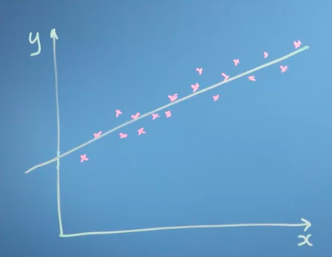
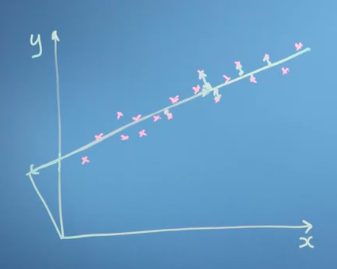
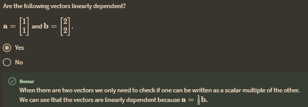
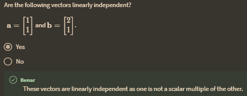
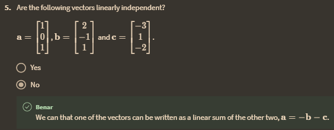

pada setiap node dapat ditarik garis yang dikenal dengan 'error'

jika kita berpikir tentang jaringan saraf dalam pembelajaran mesin yang mengenali wajah, katakanlah, mungkin saya ingin membuat beberapa transformasi dari semua antarmuka piksel menjadi basis baru yang menggambarkan bentuk hidung, rona kulit, jarak antara mata hal-hal semacam itu dan buang data piksel yang sebenarnya. Jadi tujuan dari proses pembelajaran jaringan saraf adalah entah bagaimana memperoleh satu set vektor basis yang mengekstrak fitur wajah yang paling kaya informasi.

