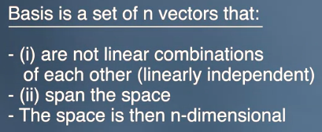
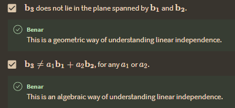

sebuah vektor dapat dikatakan independece atau tidak bisa disamakan dengan vektor lainya

istilahnya disebut  **linearly independent basis** itu terjadi jika saja b3 tersebut mengarah pada space yang berbeda. 

Basis linear dapat dikatakan linearly independent jika tidak ada satu vektor dalam basis yang dapat diwakili sebagai kombinasi linear dari vektor-vektor lain dalam basis tersebut.

Dalam kata lain, basis linearly independent adalah himpunan vektor-vektor yang tidak memiliki vektor redundan, sehingga setiap vektor dalam basis hanya dapat direpresentasikan oleh satu kombinasi linear dari vektor-vektor dalam basis tersebut. Basis yang tidak linearly independent disebut dependent, yang artinya setidaknya ada satu vektor dalam basis yang dapat direpresentasikan sebagai kombinasi linear dari vektor-vektor lain dalam basis tersebut. [ChatGPT]