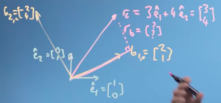
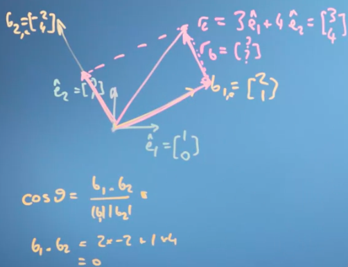
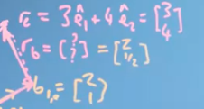
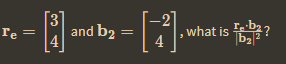

dari re ke b1, dibutuhkan faktor rb agar dapat mencapai b1, jadi seberapa besar rb itu ??. 

begitu juga ketika re ingin menyentuh b2, karena b1 dan b2 membentuk segitia sama siku. maka ia akan menghasilkan angka nol. 

kembali ke pertanyaan dari re ke b1 dibutuhkan faktor berapa, yaitu dengan menghitung rumus dibawah ini

r = $\left[\begin{array}{ccc}
4\\
2
\end{array}\right]$ = $\left[\begin{array}{ccc}
2\\
1/2
\end{array}\right]$

sehingga dapat dimasukkan ke re agar memperoleh posisi seperti b1

perkalian seperti ini akan menghasilkan nilai 1/2

b.b artinya adalah -2.-2 + 4.4