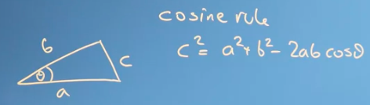
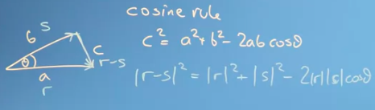
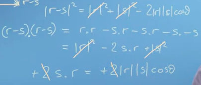

persamaan diatas dapat direpresentasikan sebagai sebuah vektor

dan ketika ditransformasikan kedalam bentuk vektor ada hal yang keren. dimana |r-s|2 ini dapat saling meniadakan untuk beberapa parameter aturan cosine
