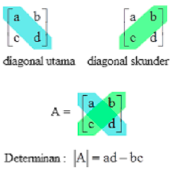

kalau mencari invers cari sendiri yah

# Einstein summation convention and the symmetry of the dot product
Konvensi Penjumlahan Einstein adalah cara yang umum digunakan untuk mengekspresikan operasi penjumlahan pada vektor dan matriks dalam matematika, fisika, dan rekayasa. 