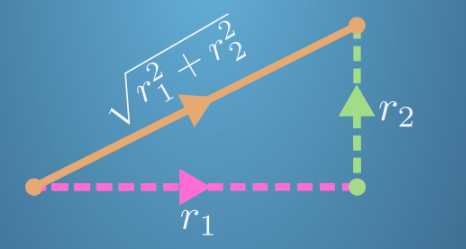
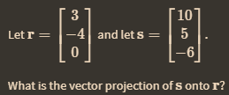
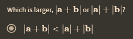

diagram dibawah direpresentasikan dalam vektor sebagai 
r = $\left[\begin{array}{ccc}
r1\\
r2
\end{array}\right]$

berapa nilai s jika diketahui s = $\begin{bmatrix}
1\\
3\\
4\\
2
\end{bmatrix}$
so, nilai s adalah akar 30

## proyeksi vektor

> We can find the angle between two vectors using the dot product.

>The size of a vector is equal to the square root of the dot product of the vector with itself.

