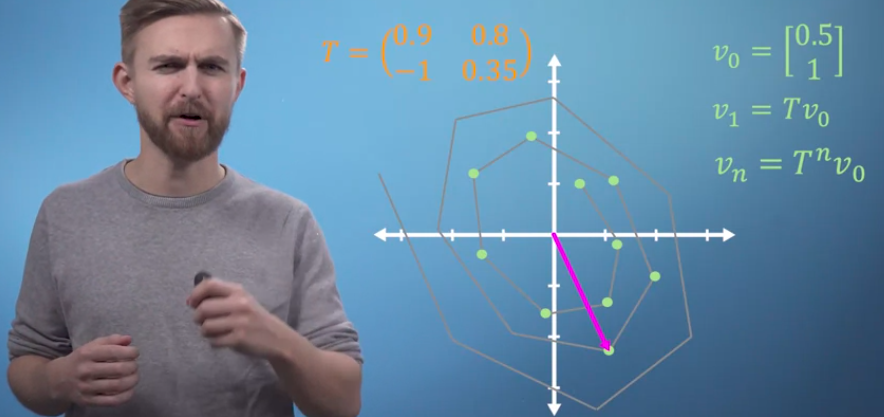
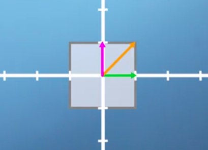
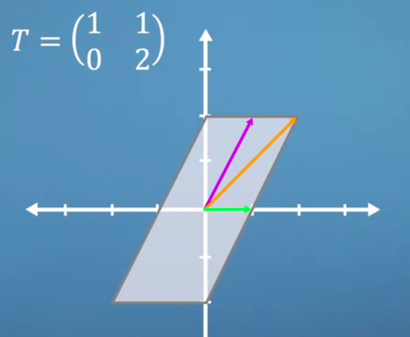
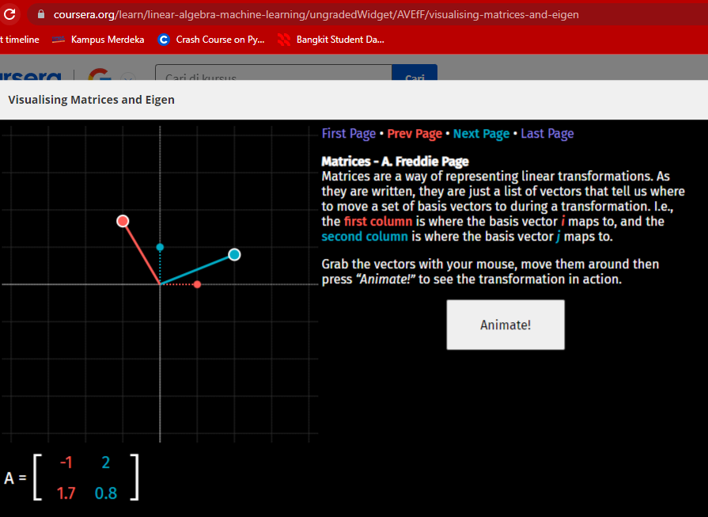
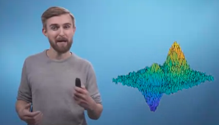

Eigen basis adalah sebuah basis dari ruang vektor yang terdiri dari vektor-vektor eigen dari suatu matriks. digunakan untuk  menyederhanakan operasi pada matriks, seperti inversi dan perpangkatan matriks. 

 lihatlah panah orange hanya bergerak lurus, seperti dibawah ini 

Visualizer eigen

nanti kek dianimasikan, trus panahnya bergerak dari titik titik (titik awal) ke arah input matriknya. 

dia adalah periset energi terbarukan, ia menggunakan machine learning untuk mengenali perilaku battery li-ion. wow...