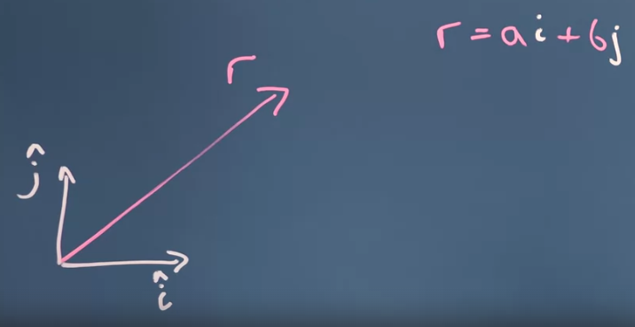
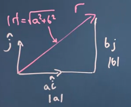
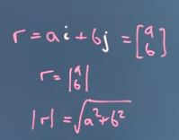
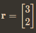
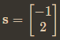
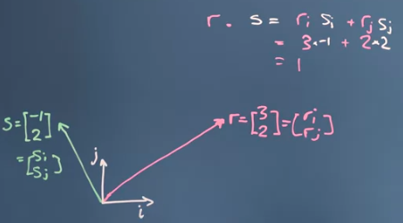

dituliskan sebagai berikut

panjang r dapat dicari menggunakan pythagoras. 

contoh soal

perkalian menggunakan dot seperti diatas harus mengembalikan nilai saja, bukan vektor

maka hasilnya adalah 
1

mereka bersifat komutatif (dapat dibolak balik)