Linear Algebra is to get a handle on vectors, which will turn out to be really useful for us in solving those linear algebra problems.

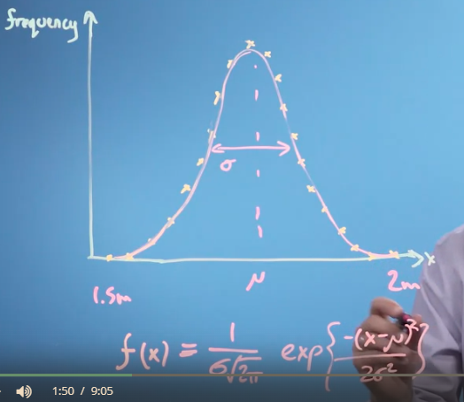

diatas adalah distribusi tinggi orang, dari 1,5 meter sampai 2 meter. kurva diatas hanya memiliki 2 parameter yaitu ```mu```  dan  ```sigma```. dimana ```mu```  merupakan representasi dari tingginya kurva distribusi dan ```sigma``` merukan lebarnya kurva distribusi.

dan fungsi (x) direpresentasikan seperti pada gambar. dari distribusi gaussian, luas area adalah sama dengan 1 karena itu merupakan suatu probabulitas (100%). 

ketika memiliki grafik gaussian yang berbeda
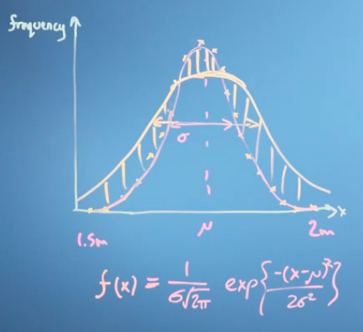
kita dapat melihat bahwa besarnya ```sigma``` akan berbeda, dengan nilai  ````mu```` sama (tetap di tengah). perbedaan grafik pertama dan kedua akan memiliki fungsi (x) yang berbeda karena parameter yang berbeda, itu akan berhubungan dengan vektor dan kalkulus. 

dapat dituliskan sebagai vektor antara ```sigma``` dan ```mu```

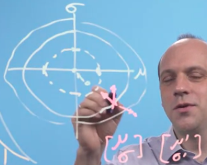

vectors don't have to be just geometric objects in the physical order of space. They can describe directions along any sorts of axes. So we can think of vectors as just being lists.

kalkulus dapat digunakan untuk menyeselaikan beberapa permasalahan terlepas bentuk geografis, misalnya kita dapat menuliskan kinerja emisinya dalam gram CO2 per 100KM untuk fungsi membunuh berapa orang, dan pencemaran lain sebagainya. 

> vectors can be viewed as a list of numbers which describes some optimisation problem. A list of number. and position on three dimension of space in one dimension of time. 
****
dibawah ini merupakan histogram yang merepresentasikan sebaran tinggi orang dengan interval 2,5 cm

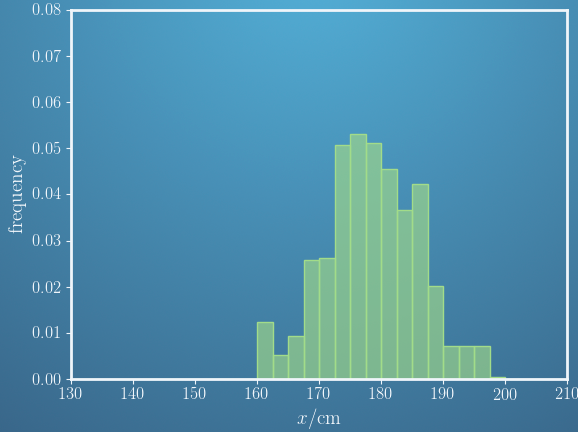

> misalnya tinggi orang dari 160 - 162,5 memiliki frekuensi 0,012 and so on

This histogram can also be represented by a vector, i.e. a list of numbers

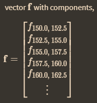

****
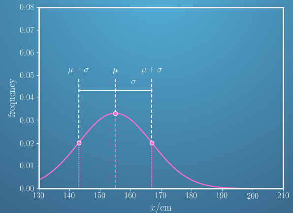

contoh tabel distribusi normal. dan memenuhi persamaan : 
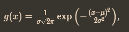
dari persamaan diatas dua parameter yang penting yaitu mu dan sigma, dua parameter tersebut dapat dimasukkan dalam vektor 
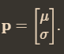
sehingga
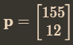

sigma juga dapat dinamakan dengan standard deviation atau lebar puncak.

***
A model is only considered good if it fits the measured data well. We need a way fit a model's parameters to data and quantify how good that fit is. salah satu model itu adalah dengan menghitung **residuals** yang merupakan perbedaan nilai lapangan dengan model prediksi

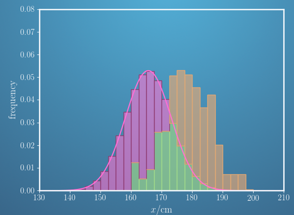
(model prediksi bewarna pink, kesamaan bewarna hijau). kesamaan yang besar menunjukkan model semakin baik. 

beberapa cara untuk memperbaiki model adalah 
1. Increase the mean, μ.
2. Keep the standard deviation, σ, approximately the same.

The performance of a model can be quantified in a single number. One measure we can use is the Sum of Squared Residuals (SSR). 

dalam bahasa vektor kita dapat menuliskan 


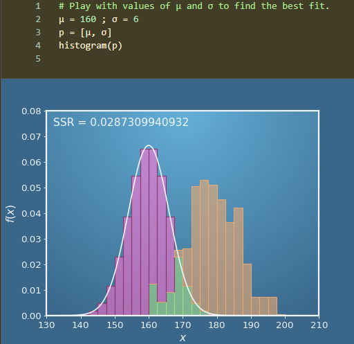
***
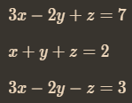
jika anda menemui persamaan diatas, anda bisa menyelesaikanya dengan mensubstitusi (3x -2y) agar tersisa z ketemu. bahkan saya menyelesaikanya tanpa melibat x + y + z =2
