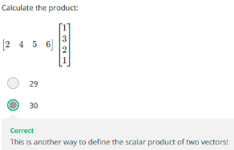
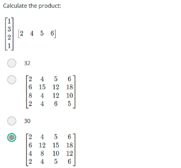
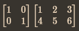
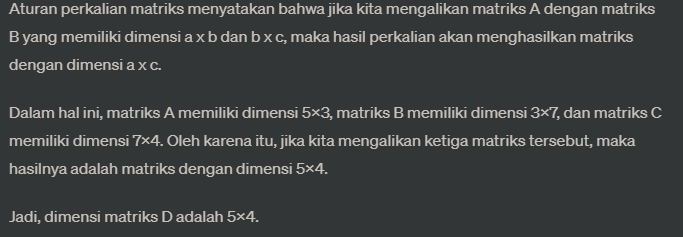
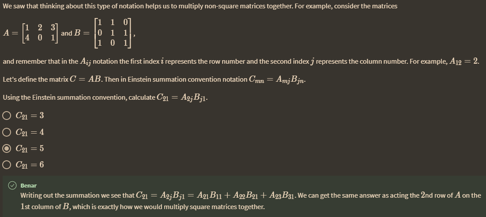
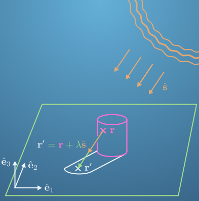

hasilnya akan berbeda dengan

perkalian dengan matrix identitas akan menghasilkan itu sendiri, seperti ini, yaitu nilai nol dengan angka 1 yang menyilang. 

[1 kolom 4 row] x [4 kolom 1 row] = 1 dimensi

***
jika D = ABC
A adalah matrik dimensi 5x3 
B adalah matrik dimensi 3x7
C adalah matrik dimensi 7x4

berapa dimensi matrik D?

einsten notation

bagaiman matrik menurutmu?

