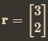
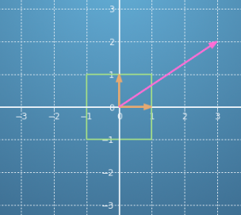
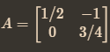
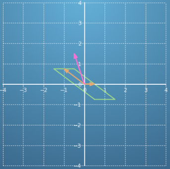
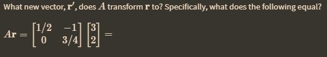
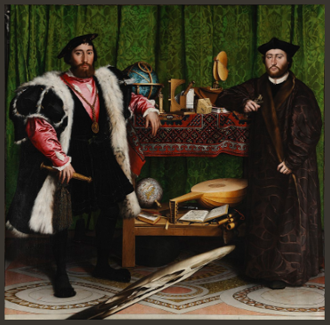
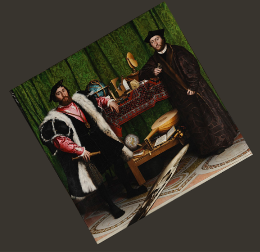
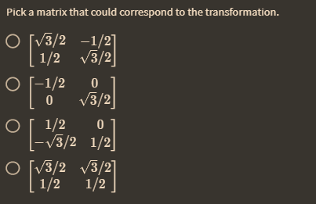
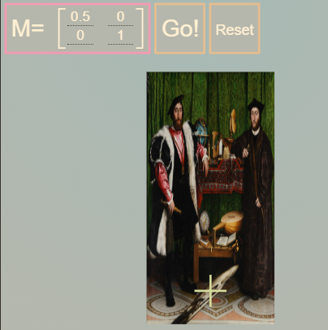
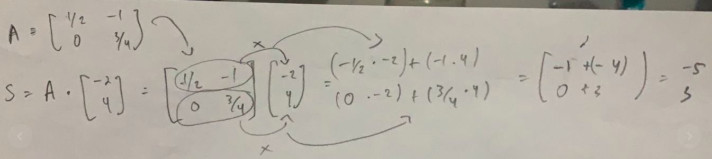

 direpresentasikan pada gambr dibawah ini 

kemudian ditransformasikan dalam bentuk  sehingga akan menjadi seperti ini 

 dan diberikan soal seperti disamping itu. sekarang anda dapat menggunakan kalkulator matrix seperti maple untuk mencari hasilnya. 

aplikasinya misalnya diberikan foto seperti dibawah

kemudian ditransformasikan dengan matrix

so the question is

Cara perkalian matrik
