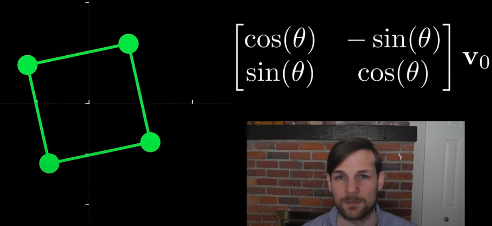
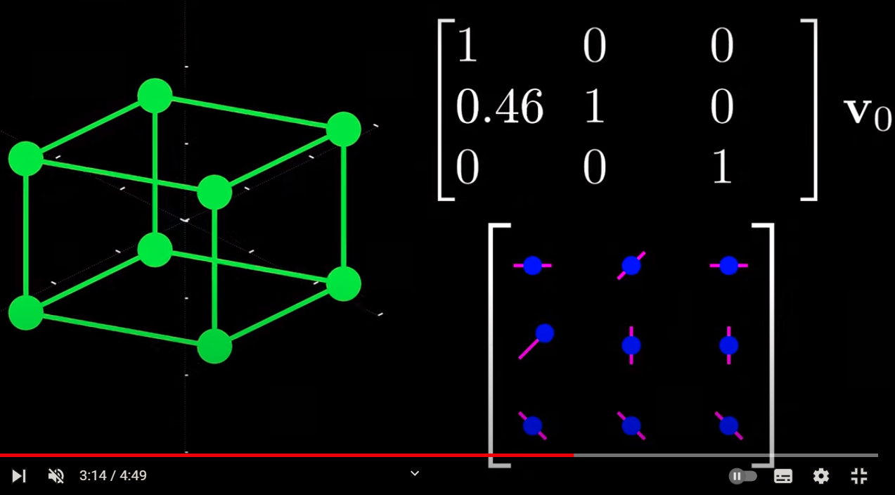
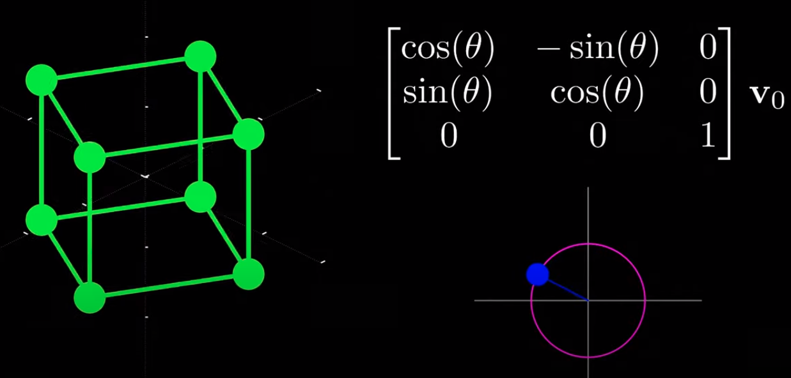

Transformasi matriks adalah suatu konsep dalam matematika dan ilmu komputer yang digunakan untuk mengubah koordinat suatu objek dalam suatu sistem koordinat menjadi koordinat objek yang sama dalam sistem koordinat lain. Transformasi ini diwakili oleh matriks, yang disebut matriks transformasi.

Matriks transformasi umumnya digunakan dalam bidang seperti grafika komputer, animasi, robotika, pengolahan citra, dan pemrosesan sinyal. Matriks transformasi dapat digunakan untuk memutar, menggeser, atau memperbesar suatu objek dalam ruang tiga dimensi atau dalam ruang dua dimensi.

Dalam robotika, matriks transformasi digunakan untuk menghitung posisi dan orientasi dari robot dalam ruang tiga dimensi. Dalam pengolahan citra, matriks transformasi dapat digunakan untuk mengubah warna atau kontras gambar. Kegunaan utama dari matriks transformasi adalah untuk memudahkan perhitungan dalam sistem koordinat yang berbeda-beda

Reference : [*](https://youtu.be/E3Phj6J287o)

Matrix 2D hadir sebagai ilustrasi 2D

dan Matrix 3D hadise sebagai ilustrasi 3D

**Matrik Orthogonal**
Matriks orthogonal adalah matriks persegi dimana setiap kolom dan barisnya berupa vektor ortogonal (yaitu, saling tegak lurus) dan memiliki panjang unit (yaitu, norma Euclidean setiap vektor adalah 1). Artinya, matriks orthogonal mempertahankan panjang dan sudut antara vektor-vektornya saat dikalikan dengan vektor-vektor lainnya.

Fungsi utama dari matriks orthogonal adalah untuk melakukan transformasi linear pada vektor-vektor sehingga menghasilkan vektor-vektor baru yang mempertahankan panjang dan sudut antara vektor-vektor awal