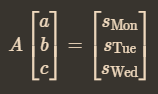
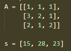

You go to the shops on Monday and buy 1 apple, 1 banana, and 1 carrot; the whole transaction totals €15. On Tuesday you buy 3 apples, 2 bananas, 1 carrot, all for €28. Then on Wednesday 2 apples, 1 banana, 2 carrots, for €23. apabila disusun dalam matrix adalah seperti ini bentuknya 

dimana
. jadi ke arah horizontal untuk monday dan seterusnya